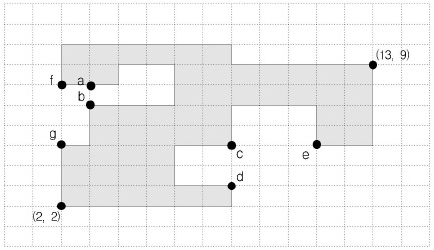

## 문제

어떤 섬나라의 해변은 수직선분과 수평선분으로만 구성되어 있다. 우리는 이 나라의 해안에 둑을 쌓아 간척지를 만들려고 한다. 이러한 간척지를 만들기 위해서 쌓아야 하는 둑은 수평 선분이거나 수직 선분이어야 한다.이때 간척지의 효율은 (간척지의 넓이)÷(둑의 길이)로 계산된다. 문제는 이 효율을 최대로 하는 간척지의 효율을 구하는 것이다.

만일, (a-b) 지점을 막아서 간척지를 만들면, 그로부터 만들어지는 간척지의 넓이는 5, 둑의 길이는 1이므로 효율은 5÷1=5가 된다. 이와 비교해서 (f-g) 지점을 막으면, 둑의 길이는 3, 그로부터 만들어지는 간척지의 넓이는 8이므로 효율은 8÷3=2.667이 된다. 따라서 (a-b) 둑이 (f-g) 둑보다 더 효율적이라고 본다. 계속해서 (c-d) 지점을 막으면 그 효율은 4÷2=2가 되고 (c-e) 지점을 막으면, 그 효율은 6÷3=2가 된다. 따라서 위의 그림과 같은 섬나라에서는 (a-b) 지점을 막는 것이 가장 효율적이다.

## 입력

첫째 줄에는 꼭짓점의 개수가 주어진다.두 번째 줄부터는 꼭짓점 좌표가 반시계 방향으로 한 줄에 다섯 개씩 순서대로 들어있다. 꼭짓점의 좌표 값은 250 이하의 양의 정수이며, 꼭짓점의 개수는 100개 이하이다.

## 출력

첫 번째 줄에 간척지의 최대 효율을 소수 셋째 자리에서 반올리하여 소수 둘째 자리까지 출력한다.
