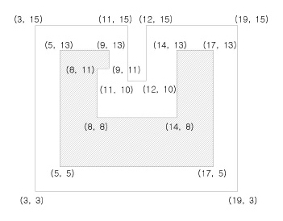
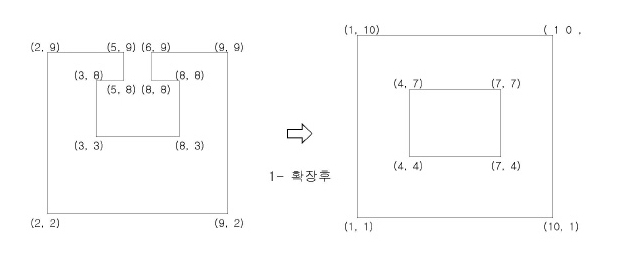

## 문제

n개의 꼭짓점들과 수평선분 및 수직선분들로 구성된 다각형은 꼭짓점들의 좌표가 주어질 때 다음과 같이 표현될 수 있다.

다각형 = {(X1, Y1), (X2, Y2), …,(Xn, Yn)}

여기서 (X1, Y1)은 맨 아래 가장 왼쪽에 있는 꼭짓점의 좌표이며, 그 다음 좌표들은 (X1, Y1)에서 반시계방향으로 다각형의 둘레를 따라 돌면서 만나는 꼭짓점들의 좌표들을 차례로 쓴 것이다.

예를 들어 아래의 그림에서 안에 들어있는 빗금 친 다각형은 다음과 같이 표현된다.

{(5,5), (17,5), (17,13), (14,13), (14,8), (8,8), (8,11), (9,11), (9,13), (5,13)} 다각형이 주어졌을 때 이 다각형의 d- 확장은 주어진 다각형의 둘레를 돌면서 d만큼 바깥쪽으로 확장시키는 것을 말한다.

예를 들어 위의 다각형을 2- 확장시키면 아래 그림에서 밖에 있는 다각형 즉,{(3,3), (19,3), (19,15), (12,15),(12,10), (11,10), (11,15), (3,15)}이 된다.

이때, d-확장에 의해 공간이 메워져서 꼭짓점의 개수가 변할 수 있다. 단, d-확장에 의해서 아래의 예와 같이 다각형 안에 구멍이 생기는 경우는 없다고 가정한다.

입력으로 d값과 다각형이 주어질 때 d-확장된 다각형을 구하는 프로그램을 작성하라.

## 입력

첫 번째 줄에 d가 주어지고 그 다음 줄에는 n이 주어진다. 그 다음 n개의 줄에 다각형을 나타내는 n개의 좌표가 주어진다. 여기서 1 ≤ d ≤ 500이고, 3 ≤ n ≤ 50이며, X, Y 좌표 값은 2000 이하의 자연수로 한다. 좌표는 반시계 방향으로 주어진다.

## 출력

확장된 다각형의 꼭짓점의 개수와 좌표들을 x값이 가장 작고, 같은 경우 y값이 가장 작은 꼭짓점부터 반시계방향으로 출력한다.
