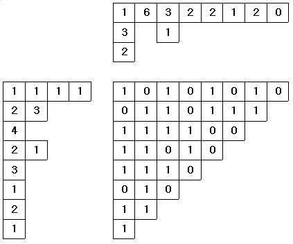

## 문제

0 또는 1로 채워진 N×N 삼각행렬을 생각해 보자. (1 ≤ N ≤ 20)이 삼각행렬의 i(1 ≤ N)번째 행과 열은 각각 n-I+1개의 문자들로 구성되어 있다. 이때, 이 행렬의 각 행과 각 열은 0과 1로 이루어진 문자열이 됨을 알 수 있다. 이러한 0과 1로 이루어진 문자열에서 연속적인 1들의 부문자열을 이용하여, 다른 형태의 순서열을 생성할 수 있다. i번째 나타난 연속적인 1들의 부문자열을 이용하여, 다른 형태의 순서열을 생성할 수 있다. i번째 나타난 연속적인 1들의 부문자열이 Ii개의 1을 포함하고 서로 겹치지 않는 부문자열의 수가 k개일 때, 새로이 생성되는 순서열은 (l1 l2 ... lk)가 된다.

예을 들어 문자열(0 1 1 0 1 1 1)에 대한 순서열은 (2 3)이다. 이제 우리는 이러한 방법으로 만들어진 순서열이 N개의 행과 N개의 열에 주어졌을 때, 원래의 0과 1로 이루어진 행렬을 만들려고 한다.

삼각 행렬의 각 행과 각 열에 대한 정보가 위에서 설명한 바와 같이 연속된 1로 구성된 부문자열에 포함된 1의 개수를 표현하는 순서열로 주어졌을 때, 그 조건을 만족하는 삼각행렬이 존재하면 재구성하는 프로그램을 작성하라.

조건을 만족하는 삼각행렬이 복수개 존재 할 경우 하나만 출력하고, 답이 존재하지 않은 경우에는 "No Answer"를 출력한다.

다음은 8×8의 경우에 대한 예이다. 각각 왼쪽과 위에 주어진 것이 입력으로 주어지는 순열이 되며, 가운데 사각행렬이 입력으로부터 재구성한 삼각행렬이다.



## 입력

행렬의 크기와 행과 열에 대한 순서열들이 아래의 형식으로 주어진다.(1 ≤ N ≤ 20)

```

n
h1 r11 r12 ... r1h1
h2 r21 r22 ... r2h2
...
hn rn1 rn2 ... rnhn
k1 c11 c12 ... c1k1
k2 c21 c22 ... c2k2
...
kn cn1 cn2 ... cnkn
```

각 행의 정보 hi, ri1, ri2,... rihi에서 hi는 i번째 행의 문자열에 대한 순서열에 포함된 원소의 수이고, ri1, ri2,... rihi 는 각 연속적인 1로 구성된 부문자열의 길이를 순서대로 열거한 것이다. 열에 대한 정보도 같은 형식으로 주어진다.

## 출력

삼각형 형태의 0과 1로 이루어진 행렬을 출력한다.

```

a1,1 a1,2 ... a1,n-1 a1,n
a2,1 a2,2 ... a2,n-2 a2,n-1
...
an-1,1 an-1,2
an,1
```
