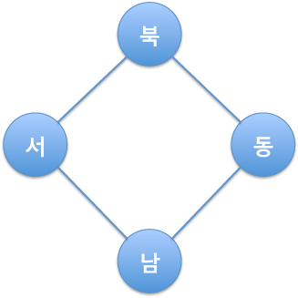
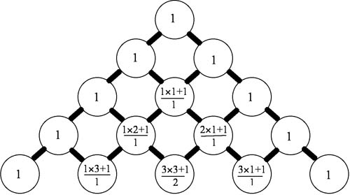

## 문제

라스칼의 삼각형은 파스칼의 삼각형과 비슷하다.

라스칼의 삼각형에서 가장 윗 줄은 0번 줄이다. i번째 줄에는 i+1개의 숫자가 들어있고, 차례대로 0번부터 i번이다. R(i,j)는 i번 줄의 j번째 숫자이다.

R(n,m) = 0 (n<0 or m<0 or m>n)

각 줄의 첫 번째와 마지막 숫자는 1이다.

R(n,0) = R(n,n) = 1

나머지 값을 채우는 방법은 (서쪽값 \* 동쪽값 + 1) / 북쪽값 이다.

이것을 수식으로 표현해보면 R(n+1,m+1) = (R(n,m) \* R(n,m+1) + 1) / R(n-1,m) 이다.

라스칼의 삼각형에서 R(n,m)을 구하는 프로그램을 작성하시오.

## 입력

첫째 줄에 테스트 케이스의 개수 T(1 <= T <= 1,000)이 주어진다. 각 테스트 케이스는 2개의 숫자 n과 m으로 이루어져 있다. (0 <= m <= n <= 50,000)

## 출력

각 테스트 케이스에 대해서 한 줄에 하나씩 R(n,m)을 출력한다.

## 힌트

