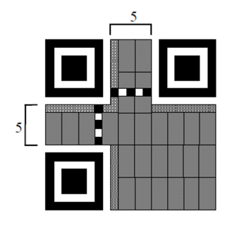

## 문제

QR 코드는 위와 같이 최소 21\*21개의 단위 픽셀로 이루어진 정방형의 흑백 픽셀 매트릭스이다.

각각의 픽셀은 나타내는 내용에 따라 위치 감지 패턴(과녁 모양의 작은 정사각형), 타이밍 패턴(교차하는 흑,백의 선), 서식 정보(작은 점들의 집합), 데이터와 오류 수정 코드(회색 픽셀 8개로 이루어진 블록들), 그리고 더 큰 QR코드의 경우 보정 패턴, 버전 정보 등으로 나뉜다.

21\*21의 최소 크기 QR 코드는 26개의 데이터 및 오류 수정 코드를 가지는데, 이는 다시 19개의 데이터 코드와 7개의 오류 수정 코드로 나뉜다.

어떤 정보를 데이터 코드로 만들 때는 10비트당 3개의 숫자, 11비트당 2개의 알파뉴메릭 문자, 8비트당 1개의 기타 8비트 문자, 13비트당 1개의 한자(Kanji)를 저장하며 다음 세 가지 정보를 함께 저장한다.

* 데이터의 종류(mode)
* 문자의 수(character count)
* 문자 정보

mode bit는 QR 코드의 크기에 따라 달라질 수 있으며, 문자 수에 대한 정보(count bits)는 데이터의 타입에 따라 다른 비트 수를 가진다.

아래는 21\*21 크기 QR 코드에서의 mode bit와 count bit에 대한 표이다.

| Mode Name | Mode Bits | Count Bits |
| --- | --- | --- |
| Numeric | 0001 | 10 |
| Alphanumeric | 0010 | 9 |
| 8 bit byte | 0100 | 8 |
| Kanji | 1000 | 8 |
| Termination | 0000 | 0 |

숫자를 표현하기 위해 mode bit로 0001을 사용하며, 그 뒤 10개의 비트는 숫자의 개수를 나타낼 것이다.

터미네이션 코드로 데이터는 종료되며 만일 데이터 코드를 저장할 공간이 없다면 터미네이션 코드는 생략되거나 불완전한 형태일 수도 있다.

터미네이션 코드 이후로 등장하는 불완전한 코드 조각은 비어있는 부분을 0으로 채우게 되며, 그 이후로 남는 빈 공간에는 11101100과 00010001을 교대로 채운다. 이에 대한 예시는 문제 설명 마지막 부분에서 자세히 볼 수 있다.

수로 이루어진 문자열은 한 번에 3자리씩 저장된다. 마지막 남은 문자열이 2글자일 경우엔 7bit로, 1글자일 경우엔 4bit로 저장한다. 아래는 예시이다.

**12345678 → 123 456 78 → 0001111011 0111001000 1001110**

이 앞에 mode 정보(0001)와 count bit(8 = 0000001000)가 들어간다.

**0001 0000001000 0001111011 0111001000 1001110**

알파뉴메릭 문자열은 다음 45개 문자들을 포함하고 있는 문자열이다.(<SP>는 스페이스바를 나타낸다)

**0123456789ABCDEFGHIJKLMNOPQRSTUVWXYZ<SP>****\$%\*+-./:**

각각의 알파벳은 0부터 44의 수로 대응되며, 알파뉴메릭 두 문자는 다음과 같이 인코딩된다.

**<first char code> \* 45 + <second char code>**

만일 한 개의 문자가 남는다면, 이것은 6 비트로 인코딩된다.

예시는 다음과 같다.

**AC-42 → (10, 12, 41, 4, 2) → 10\*45 + 12 = 462, 41\*45 + 4 = 1849, 2 →  00111001110** **11100111001 000010**

이 앞에 mode bit(0010) 과 count bit(5 = 000000101) 가 삽입되어 총 비트 수는 4+9+11+11+6 bit가 된다.

8비트 문자/숫자와 한자를 저장하는 다음의 과정은 비교적 간단하다. 8비트 문자는 어떤 8비트의 코드로, 한자는 어떤 13비트의 코드로 저장될 것이며 그 문자를 찾는 대신 그저 16진수로 코드를 표현해내기만 하면 된다.

예시는 다음과 같다.

**8 bit 0x45 0x92 0xa3 → 01000101 10010010 10100011**

이 앞에 mode bit와 count bit가 삽입되어 다음과 같이 된다

**0100 00000011 01000101 10010010 10100011**

총 비트 수는 4 + 8 + 8 + 8 + 8이 된다.

한자에 대한 예시는 다음과 같다.

**Kanji 0x1ABC 0x0345 → 1000 00000010 1101010111100 0001101000101**

총 비트 수는 4 + 8 + 13 + 13이다.

19개의 데이터 블록엔 각각의 블록당 위의 규칙에 따라 변환한 코드를 8비트 단위로 끊어서 표현한 이진수 묶음이 입력된다. 모든 정보를 저장한 뒤엔 터미네이트 코드가 주어지며, 터미네이트 코드의 mode bit까지 표현한 후 불완전한 데이터 블록이 생겼다면 남은 부분을 0으로 채운다. 이때 데이터 블록이 19개 미만이라면 11101100과 00010001을 교대로 삽입하여 19개의 데이터 블록을 만든다.

예시는 다음과 같다.

**0001 0000001000 0001111011 0111001000 1001110**

**0010 000000101 00111001110 11100111001 000010**

**0100 00000011 01000101 10010010 10100011**

**0000 000000 11101100 00010001 11101100**

위의 코드는 다음과 같이 19개의 데이터 블록에 인코딩된다.

**00010000 00100000 01111011 01110010 00100111 00010000 00010100 11100111 01110011 10010000 10010000 00001101 00010110 01001010 10001100 00000000 11101100 00010001 11101100**

**→ HEX 10207B72271014E77390900D164A8C00EC11EC**

위의 마지막 결과처럼 16진수로 인코딩된 19개의 데이터 블록이 주어지면 그에 따라 원래 정보를 복원하는 프로그램을 작성하라.

## 입력

첫 줄에 테스트 케이스의 수 P가 주어진다 (1 ≤ P ≤ 1000)

각각의 테스트 케이스는 한 줄로 표현된 19개의 데이터 블록이며, 38개의 16진수 문자가 주어진다. 0~9, A~F 외의 잘못된 문자가 주어지는 경우는 없다.

## 출력

각각의 테스트 케이스에 대해 다음과 같이 한 줄을 출력한다.

* 문자의 수를 나타내는 정수 하나
* 공백으로 구분하여, 디코딩된 문자열

만일 출력 문자열이 출력 가능한 아스키 문자라면(0x20~0x7e) 그대로 출력하면 되며, 다만 예외로 백슬래시( \ )는 \\ 로, #은 \# 으로 출력하면 된다.

출력 불가능한 문자일 경우엔

* 8bit 문자일 경우 : \xx, x는 16진수로 표현했을 경우의 자리수(예시 : \AE)
* 13bit 문자일 경우 : #bxxx : b는 0 또는 1, x는 16진수로 표현했을 경우의 자리수(예시 : #13AC)

를 출력하면 된다.

0x20(스페이스바)보다 작거나 0x7e(~)보다 큰 모든 8bit 아스키 문자 혹은 모든 13bit 문자는 출력 불가능한 문자이다.
