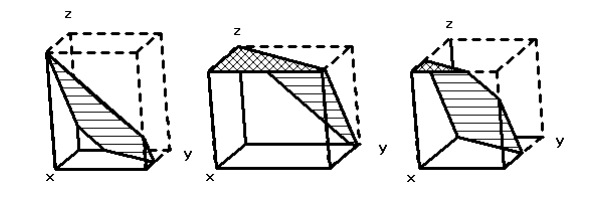

## 문제

백범로에 있는 서강 은행의 본사는 2002년에 지어졌다. 2013년, 의장인 최준민은 은행 아트리움의 천장을 황금잎으로 재단장하기로 결심했다. (얼마 후 그는 소리소문없이 잠적해버렸다.)

새 천장은 평범하지 않아서, 아트리움의 일부가 기울어져 있었다. (그래서 아트리움은 더 커보였다) 아트리움의 크기와 기울어진 천장의 위치, 경사도는 정해지지 않았다.

준민이는 상범마법황금잎회사에서 천장과 기울어진 면을 장식할 황금잎을 얼마나 주문해야하는지 알고 싶었다. 또한 그는 비스듬한 부분이 천장이나 바닥과 닿는 것도 허가했다.

다음은 아트리움의 예제이다.

Note: 점선으로 그린 부분은 원래 박스를 나타내며, 빗금친 부분은 기울어진 부분을 표시한다.

빗금이 두번 쳐진 부분은 원래 천장 부분을 나타낸다. 벽과 바닥은 투명하다.

황금잎으로 덮을 부분은 천장과 기울어진 부분이다.

천장을 덮기 위해 얼마나 황금잎이 필요한지 계산하는 프로그램을 작성하시오.

## 입력

첫째 줄은 데이터 세트의 개수를 나타내는 P(1 ≤ P ≤ 1000)가 입력으로 들어온다. 각각의 데이터 세트는 한 줄로 구성되어 있으며 L, W, H, A, B, C, D가 공백으로 구분되어 들어온다. L,W,H는 가로, 세로, 높이를 뜻하며 단위는 준민이다. (모두 양수) A,B,C,D는 다음 평면의 방정식의 계수로, 평면은 기울어진 부분을 나타낸다.

Ax + By + Cz = D

0 ≤ x ≤ L, 0 ≤ y ≤ W, 0 ≤ z ≤ H

원래 박스의 한쪽 끝은 항상 (0,0,0)에 위치하며 다른 쪽은 (L,W,H)에 위치한다. 평면은 수직이 되지 않으며 (C ≥ 1.0) 항상 박스 안쪽을 지나간다.

## 출력

각각의 데이터 세트에 대해 한 줄씩 천장을 덮기 위해 필요한 황금잎을 제곱준민 단위(정수)를 공백으로 구분하여 출력한다. (제곱준민 단위를 올림)
