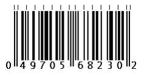
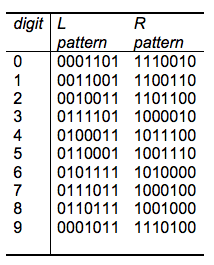
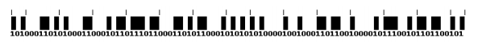
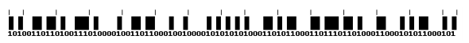

## 문제

FoodVictory의 물류 관리자인 영우는 [2685](./002_2685)번에서 용태에게 패배한 충격으로 그만 바코드 데이터베이스 일부를 날려버렸다. 이 사건이 알려지면 영우는 굉장히 곤란한 상황에 처하게 되므로 지푸라기라도 붙잡는 심정으로 인터넷에 바코드를 검색해 보았다.

UPC-A 바코드는 12자리의 십진수를 번갈아나며 나타나는 "밝은" 부분과 "어두운" 막대로 이루어진 15개의 패턴으로 표현한다. 이 패턴은 SLLLLLLMRRRRRRE와 같은 패턴이다. 여기서 S는 시작 패턴으로 101(1은 "어두운" 막대이고 0은 "밝은" 막대이다)이고, M은 중간 패턴으로 01010이다. 그리고 E는 끝 패턴으로 101이다. L은 왼쪽 패턴으로 각 자리가 10진수의 첫 6자리와 대응되고, R은 오른쪽 패턴으로 각 자리가 10진수의 뒤 6자리와 대응된다. 각 막대의 두께는 일정한 값(바코드의 가로 크기)의 배수이며, 바코드 위의 작은 표시는 패턴(S, L, M, R, E)의 시작을 표시한다. (단, 가장 마지막 표시는 바코드의 끝을 나타낸다) 바코드에는 총 3 + 5 + 3 + 12\*7 = 95개의 코드(1,0)가 있어야 하고, 양 끝에 최소한 9개의 "밝은" 막대가 있어야 한다.

바코드의 십진수 마지막 자리는 체크섬 숫자이며, 다음과 같이 계산한다.

(digitN = 십진수의 N번째 자리, check\_digit = 마지막 자리)

```

CheckSum = 3*(digit1 + digit3 + digit5 + digit7 + digit9 + digit11) + digit2 + digit4 + digit6 + digit8 + digit10;
Code = CheckSum % 10;
If (Code == 0) check_digit = 0;
else check_digit = (10 - Code);
```



바코드 스캐너는 카메라를 이용해 바코드의 좁은 이미지를 읽어내고, 이미지로부터 코드를 추론해낸다.



바코드가 뒤집혀진채로 읽힌다면 코드가 반대 방향으로 읽히게 된다.



안타깝게도, 색상 대비의 부족이나 반짝이는 물체의 반사때문에 이 이미지는 언제나 명확하지는 않다.


위의 그림을 보면, 확실히 밝은 막대인지 어두운 막대인지 제대로 알아볼 수가 없다. 하지만 이런 경우에도 대부분은 바코드를 인식할 수 있는데, 그 이유는 다음과 같다. 첫째, 128가지의 가능한 7-비트 숫자중 20개만이 사용된다. 둘째, 체크섬이 맞아 떨어지는 경우에만 옳은 바코드이다. 마지막으로, 여러 바코드가 매치된다고 해도, 그중 두 개 이상이 같은 목적으로 데이터베이스에 저장되어있을 가능성은 희박하다.

자, 영우의 위기를 막기 위해 손상된 바코드와 매칭될 수 있는 모든 옳은 바코드의 목록을 출력해주자(뒤집혀서 읽힌 경우도 고려할것!). 손상된 바코드는 0과 1, 그리고 ?(손상되어 알 수 없는 부분)으로 이루어진 95자의 코드로 표현된다

## 입력

첫째 줄에 테스트 케이스의 개수 T가 주어진다. 각 테스트 케이스는 두 줄로 이루어져 있는데, 첫째 줄에는 바코드의 첫 50자가, 둘째 줄에는 바코드의 마지막 45자가 주어진다.

## 출력

각 테스트 케이스마다 첫째 줄에는 입력과 매치되는 올바른 바코드의 개수를 출력하는데, 만약 매치되는 개수가 8보다 크다면 9를 출력한다. 그 다음 줄부터는 매치되는 모든 바코드를 증가하는 순서로 한 줄에 한 개씩 출력한다. (단, 매치되는 바코드의 수가 9 이상이라면 첫 8개만 출력한다)
