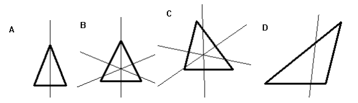

## 문제

동규는 자신의 쌍둥이 아들 승환이와 규현이를 위해 매년 삼각형 모앙의 생일 케익을 사온다. 동규가 사오는 케익의 모양은 매년 다르다. 케익의 옆은 초콜릿 아이싱이 덮여있고, 위에는 핑크 아이싱이 덮여있다. 승환이와 규현이는 이 2개의 아이싱을 모두 좋아하기 때문에, 서로 같은 양을 먹으려고 한다.

규현이와 승환이가 같은 양을 먹기 위해서 케익을 자르는 프로그램을 작성하시오.

삼각형 이퀼라이저란 삼각형을 동일한 둘레와 넓이로 나누는 선이다. 이 선은 삼각형을 통과한다. 아래 그림의 선은 모두 그 삼각형의 삼각형 이퀼라이저이다.

일반적으로 삼각형은 1, 2, 또는 3개의 이퀼라이저를 갖는다. (2개인 경우는 특수한 조건일 때만 나타난다)

삼각형이 주어졌을 때, 삼각형 이퀼라이저를 하나만 구하는 프로그램을 작성하시오. 이때, double을 이용해서 계산을 하면 된다.

## 입력

첫째 줄에 테스트 케이스의 개수 P(1 ≤ P ≤ 1000)가 주어진다. 각 테스트 케이스는 한 줄로 이루어져 있고, 각 줄은 6개의 실수로 이루어져 있다. 6개의 실수는 삼각형의 꼭짓점 좌표이고, x0, y0, x1, y1, x2, y2 순서이다.

입력으로 주어지는 실수는 절댓값이 20보다 작으며, 항상 소숫점 5째자리까지 주어진다.

## 출력

각 테스트 케이스에 대해서, 주어진 삼각형의 이퀼라이저의 직선의 방정식을 출력한다. 방정식을 Ax + By = C 꼴로 나타낸 뒤, A, B, C를 공백으로 구분해서 소수점 5째자리까지 출력하면 된다. 이때, A\*A + B\*B = 1.0, A >= 0이다.
