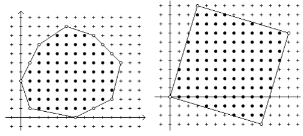
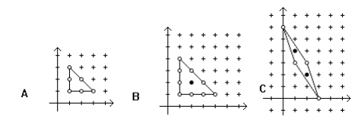

## 문제

격자점은 좌표가 정수인 점을 뜻한다.격자 다각형은 모든 꼭짓점이 격자점인 다각형이다.

다각형의 경계에 있는 격자점을 경계점이라 한다. (위 그림에서 열린 점) 또한 다각형 위에 있지 않은 내부의 격자점을 내부점이라 한다. (위 그림에서 닫힌 점)

다각형의 내부에 있는 어떠한 두 점을 골라 만든 선분이 모두 다각형의 내부 또는 경계에 있다면 그 다각형을 볼록하다고 한다. 즉, 내각의 크기가 모두 180도보다 작다. 다각형 내부(경계 위의 점은 제외한다)에 있는 두 점 사이의 모든 선분도 다각형의 내부에 완벽하게 들어간다.

볼록 격자 다각형의 내부점 중 수평선 상의 점에는 가장 왼쪽 점과 가장 오른쪽 점이 존재한다. (가장 왼쪽 점과 가장 오른쪽 점이 같을 수 있다) 아래 그림 A처럼 내부점이 없거나, B처럼 하나뿐인 경우가 있을 수도 있다. 그림 C의 경우 아래 그림과 같다.

볼록 격자 다각형을 아래와 같은 순서로 입력 받아, 수평선을 이루는 내부점을 모두 출력하는 프로그램을 작성하시오.

1. 첫 번째 점은 y값이 가장 큰 점이다. 만약 y값이 같은 점이 있다면 x값이 작은 순으로 주어진다.

2. 점은 시계방향으로 주어진다.

## 입력

입력의 첫 줄에는 테스트의 개수 P(1 ≤ P ≤ 1000)가 주어진다.

각각의 테스트 첫 줄에는 다각형 점의 개수를 나타내는 정수 N(3 ≤ N ≤ 50)이 주어진다. 나머지 줄에는 위에 설명된 순서대로 점의 x좌표와 y좌표를 나타내는 정수 두 개가 공백을 사이에 두고 주어진다. 입력으로 주어지는 좌표는 -30보다 크거나 같고, 30보다 작거나 같은 정수이다.

## 출력

첫 줄에는 수평선의 개수를 출력한다. 만약, 수평선이 하나 이상 있다면, 수평선의 y 좌표 값을 한 줄에 하나씩 출력한다. 이때 y좌표 내림차순으로 출력한다. 각각의 y좌표 값 뒤에 공백을 사이에 두고 가장 왼쪽 x좌표와 가장 오른쪽 x좌표를 출력한다.
