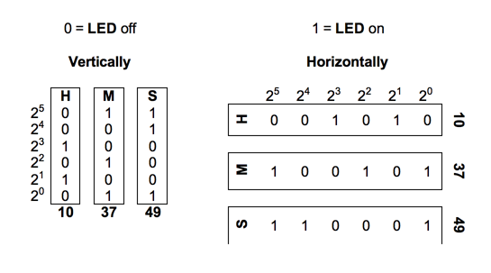

## 문제

이진법 시계는 60초-60분-1시간 체계의 일반적인 시간을 이진수로 표시해주는 시계이다. 일반적으로는 3행 혹은 3열의 LED에 0 또는 1을 표시하여 시간을 표시하는 방식이 주로 쓰인다.

3열 방식은 위 왼쪽 그림과 같이 6행 3열로 이루어져 있다. 각 열은 왼쪽부터 차례대로 시간, 분, 초를 나타낸다. 각 행은 첫 행의 수는 2 5를 나타내고 그 아래 수는 24를, 그렇게 6행은 1까지의 값을 갖는다.

3행 방식은 위의 오른쪽 그림처럼 3행 6열로 이루어져 있다. 3열 방식과는 반대로 3개의 행이 각각 시간, 분, 초를 나타내며, 각 열은 1열이 2 5, 2열이 24, ... , 6열이 1을 나타낸다.

위의 시계는 두 경우 모두 10시 37분 49초이다.

시계를 읽는 방식은 두 경우 모두 행우선 좌->우로 읽는다.

예를 들어 10시 37분 49초를 나타내는 이진법 시계의 3열 방식은(위의 예제) 011001100010100011로 읽으며, 3행 방식은 001010100101110001로 읽는다.

문제에서는 1시간-60분-60초 형태에 맞는 올바른 시각 하나가 주어진다.

이제 이 시간을 이진법 시계에서의 방식으로 나타내고, 3열 방식과 3행 방식으로 읽는 프로그램을 작성하면 된다.

## 입력

첫 줄에 테스트 케이스의 수 N이 주어진다. (1<=N<=1000)

각 케이스마다 10진법에서의 시간, 분, 초로 나타낸 시각이 한 줄에 예제의 형식과 같이 주어진다.

## 출력

각 테스트 케이스마다, 3열 방식으로 읽은 이진법 시계의 시각과 3행 방식으로 읽은 이진법 시계의 시각을 공백으로 구분하여 출력한다. 각각 18개의 비트를 가져야 한다.
