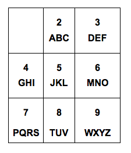

## 문제

표준 휴대전화의 키패드에는 글자들이 다음과 같이 번호키와 대응되어있다.

글자 C를 입력하기 위해서는 '2'키를 3번 눌러야 한다. 이와 같이 글자를 입력하기 위해 눌러야 하는 키의 번호와 눌러야 하는 횟수는 글자가 어떤 키의 리스트에 속해있는가와 리스트에서 몇 번째인지에 따라 다르다.

Exupery Telephone Company (ETC)는 축적된 글자별 사용 빈도 데이터베이스를 이용하여 휴대전화 사용자들의 평균 키 입력 횟수를 줄이기 위해 글자 배치들을 변경하려고 한다. 예를 들어, S를 7키에서 8키로 옮길 수 있다.

글자들이 나타나는 순서는 알파벳 순서를 지켜야 하지만 각 키마다 배정되는 글자의 수는 달라도 된다.

각 알파벳의 빈도수와 키의 개수가 주어졌을 때, 알파벳을 어떻게 배치해야 입력 회수의 평균값이 작아지는지 구하는 프로그램을 작성하시오.

각 키에 알파벳은 적어도 한 개 있어야 하며, 많아야 여덟 개까지 있을 수 있다.

## 입력

첫 번째 줄에 테스트 케이스의 수 T가 주어진다. 각 테스트 케이스는 세 줄로 이루어진다: 첫째 줄에는 키의 개수 K가 주어진다 (4 ≤ K ≤ 26) 둘째 줄에는 첫 13개 알파벳의 사용 빈도가 주어진다. 셋째 줄에는 마지막 13개 알파벳의 사용 빈도가 주어진다.

## 출력

각 테스트 케이스에 대해 최적의 키 배열에서의 평균 키 입력 횟수(소수점 셋째자리까지), A~Z의 배열을 공백을 사이에 두고 출력한다.
