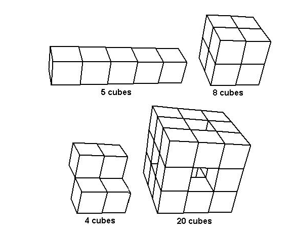

## 문제

폴리큐브는 모서리의 길이가 1인 단위 정육면체를 면과 면끼리 붙여서 만든 입체이다. 아래 그림에서 왼쪽 아래 입체는 선과 선끼리 붙였기 때문에, 폴리큐브가 아니다.

폴리큐브를 이루는 정육면체의 중심은 모두 3차원 공간에 있고, 정수 좌표이다.

폴리큐브를 만들기 위해서 가장 처음 (0, 0, 0)에 있는 큐브부터 시작한다. 그 다음, 폴리큐브를 만드는 각 단계에서 다음 정육면체는 반드시 이전 정육면체와 면이 닿아야 한고, 지금까지 나오지 않은 정육면체이어야 한다. 예를 들어, 그림에서 왼쪽 위에 있는 폴리큐브는 아래와 같이 만들 수 있다.

(0,0,0) (0,0,1) (0,0,2) (0,0,3) (0,0,4)

그리고, 오른쪽 위에 있는 폴리큐브는 다음과 같이 만들 수 있다.

(0,0,0) (0,0,1) (0,1,1) (0,1,0) (1,0,0) (1,0,1) (1,1,1) (1,1,0)

폴리큐브는 단위 정육면체로 이루어져있기 때문에, 이것의 겉넓이은 모두 정수이다.

3차원 공간의 좌표가 주어질 때, 이것이 폴리큐브를 이루어지는지 구하고, 폴리큐브라면 겉넓이를 구하는 프로그램을 작성하시오.

## 입력

첫째 줄에 테스트 케이스의 개수 T(1 ≤ T ≤ 1,000)가 주어진다. 각 테스트 케이스는 다음과 같이 이루어져 있다. 첫째 줄에는 점의 개수 P(1 ≤ P ≤ 100)가 주어진다. 그 다음줄부터 정육면체의 중심 좌표가 차례대로 한 줄에 8개씩 주어진다.

입력으로 주어지는 좌표는 4보다 작거나 같은 음이 아닌 정수이다.

## 출력

각 테스트 케이스에 대해서 폴리큐브를 이룬다면 그것의 단면적을 출력하고, 아니라면 NO를 출력한 뒤에, 몇 번째 정육면체 폴리큐브를 이룰 수 없었는지를 출력한다. 첫 번째 정육면체는 1번이다.
