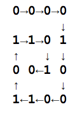

## 문제

규현이는 승환이에게 사랑을 담은 문자 메시지를 자주 보낸다. 이것을 남에게 보이기 싫었던 규현이는 승환이와 비밀 규칙을 만들었다.

규현이는 비밀 메시지를 만들기 위한 행렬의 행의 수 R과 열의 수 C를 정했다. 그 다음 다음과 같은 규칙으로 비밀 메시지를 만든다.

1. 모든 글자는 알파벳 대문자와 공백으로 이루어져 있다.
2. 글자는 다음과 같이 숫자로 바뀐다. 공백 = 0, A = 1, B = 2, ..., Y = 25, Z = 26

먼저 규현이는 문자를 위 규칙을 이용해 글자를 숫자로 바꾼 다음에 이것은 5자리 이진수로 바꾼다. 그 다음 아래 그림과 같이 소용돌이 패턴으로 행렬에 채운다. 행렬의 모든 칸을 채우지 못할 때는, 0으로 계속 채운다. 예를 들어 규현이가 보내려는 메시지가 "ACM"이고, R=4, C=4로 정했다면, 다음과 같이 행렬을 채우면 된다.

A = 00001, C = 00011, M = 01101, 모자라는 칸은 0으로 채운다.

그 다음 행렬을 행 우선으로 읽은 뒤 (Row Major Order)에 승환이에게 보낸다.

위의 예시를 메시지로 보낸다면 0000110100101100이 된다.

승환이가 받은 비밀 메시지와 R과 C가 주어졌을 때, 이를 규현이가 보낸 문자 메시지로 변환하는 프로그램을 작성하시오.

## 입력

첫째 줄에 테스트 케이스의 개수 T가 주어진다. (1 ≤ T ≤ 1,000) 각 테스트 케이스는 한 줄로 이루어져 있고, R, 공백, C, 공백, 승환이가 받은 메시지로 이루어져 있다. (1 ≤ R, C ≤ 21) 메시지는 0과 1로만 이루어져 있고, 이 길이는 항상 R\*C이다.

## 출력

각 테스트 케이스에 대해 규현이가 보내려고 변환되기 전 문자 메시지를 출력한다. 이때, 원래 문자 메시지가 공백으로 끝난다면, 그 공백을 모두 제거한 뒤에 출력한다.
