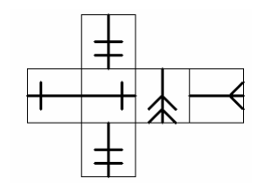
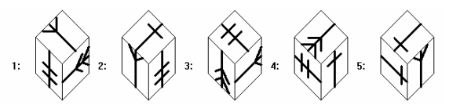
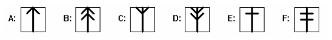
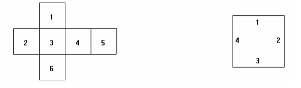
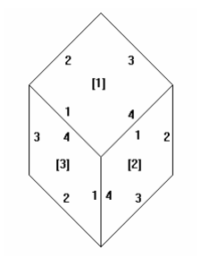

## 문제

Exupery Testing Corporation (ETC)는 많은 회사의 인사과에 다양한 시험을 공급하는데, 그중 한 시험에는 다음과 같은 공간지각력을 묻는 질문이 있다.

다음 정육면체의 전개도를 다시 접었을 때, 다음 중 어는 모양이 되는가?

안타깝게도, ETC는 최근 이런 문제 중 답이 없거나 답이 두 가지인 경우를 발견하게 되었다.

ETC는 펼쳐진 정육면체와 코너 뷰(위의 보기와 같은)를 입력받아 이 코너 뷰가 정육면체의 모양과 일치하는지 결정하는 프로그램이 필요하다.

ETC는 다음과 같은 이미지들을 정육면체의 면에 사용한다. 각 이미지는 세로 축에 대해 대칭이고, 끝 모양이 모두 다르다.

정육면체의 전개도는 이미지와 끝 모양이 향하는 방향을 나타내는 6개의 쌍으로 이루어진다. 1은 위쪽, 2는 오른쪽, 3은 아래쪽, 4는 왼쪽 (오른쪽 그림 참고) 각 면들은 주어지는 순서에 따라, 왼쪽 그림과 같은 자리를 나타낸다.

따라서 예로 주어진 문제의 전개도는 "F3E4E2D3C2F3"으로 나타낼 수 있다. ETC는 이런 문자열을 읽어서 전개도를 만드는 프로그램을 가지고있다.

답지의 보기 이미지는 면의 이미지와 방향을 나타내는 3개의 쌍으로 이루어진다 (아래 그림 참고). 면들은 주어지는 순서에 따라 위, 오른쪽, 왼쪽을 나타내며 (그림의 [] 안 숫자 참고) 방향은 아래 그림의 숫자들을 참고하면 된다.

예를 들어, 예로 주어진 문제의 보기들은 다음과 같이 나타낼 수 있다. "C2D2F2", "E3F4C4", "F2C2D2", "D1E1F3", "E1C1E1"

## 입력

첫 번째 줄에는 테스트 케이스의 개수 T가 주어진다. 각 테스트 케이스는 여섯 개의 줄로 이루어진다. 첫 번째 줄에는 정육면체의 전개도가 주어지고, 다음 다섯 개의 줄에는 보기들이 주어진다.

## 출력

각 테스트 케이스에 대해 두 가지를 공백을 사이에 두고 출력한다. 정답의 개수, 각 보기가 정답인지의 여부. (정답인 경우 Y, 아닌 경우 N. 예) 모두가 정답이라면 Y Y Y Y Y)
