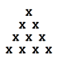

## 문제

n번째 삼각수, T(n)은 1부터 n까지의 합이다. T(n) = 1 + ... + n. 이것은 삼각형 모양으로 표현할 수 있다. 아래 그림은 T(4)를 나타낸 것이다.

다음과 같은 식을 통해 가중치를 부여한 삼각수의 합을 구할 수 있다.

W(n) = Sum[k=1..n; k\*T(k+1)]

n이 주어졌을 때, W(n)을 구하는 프로그램을 작성하시오.

## 입력

첫째 줄에 테스트 케이스의 개수 T가 주어진다. 각 테스트 케이스는 정수 n 하나로 이루어져 있다. (1<=n<=300)

## 출력

각 테스트 케이스에 대해 W(n)을 한 줄에 하나씩 출력한다.
