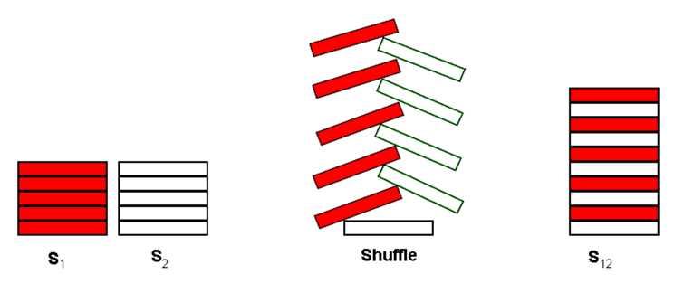

## 문제

A common pastime for poker players at a poker table is to shuffle stacks of chips. Shuffling chips is performed by starting with two stacks of poker chips, S1 and S2, each stack containing C chips. Each stack may contain chips of several different colors.

The actual shuffle operation is performed by interleaving a chip from S1 with a chip from S2 as shown below for C=5:

The single resultant stack, S12, contains 2\*C chips. The bottommost chip of S12 is the bottommost chip from S2. On top of that chip, is the bottommost chip from S1. The interleaving process continues taking the 2nd chip from the bottom of S2 and placing that on S12, followed by the 2nd chip from the bottom of S1 and so on until the topmost chip from S1 is placed on top of S12.

After the shuffle operation, S12 is split into 2 new stacks by taking the bottommost C chips from S12 to form a new S1 and the topmost C chips from S12 to form a new S2. The shuffle operation may then be repeated to form a new S12.

For this problem, you will write a program to determine if a particular resultant stack S12 can be formed by shuffling two stacks some number of times.

## 입력

The first line of input contains a single integer N, (1 ≤ N ≤ 1000) which is the number of datasets that follow.

Each dataset consists of four lines of input. The first line of a dataset specifies an integer C, (1 ≤ C ≤ 100) which is the number of chips in each initial stack (S1 and S2). The second line of each dataset specifies the colors of each of the C chips in stack S1, starting with the bottommost chip. The third line of each dataset specifies the colors of each of the C chips in stack S2 starting with the bottommost chip. Colors are expressed as a single uppercase letter (A through H). There are no blanks or separators between the chip colors. The fourth line of each dataset contains 2\*C uppercase letters, (A through H), representing the colors of the desired result of the shuffling of S1 and S2 zero or more times. The bottommost chip’s color is specified first.

## 출력

Output for each dataset consists of a single line that displays an integer value which is the minimum number of shuffle operations required to get the desired resultant stack. If the desired result can not be reached using the input for the dataset, display the value negative 1 (-1) for the number of shuffle operations.
