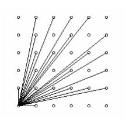

## 문제

(0,0)에서 보이는 (x,y)의 개수를 구하려고 한다.(x,y >= 0, 정수)

(0,0)에서 (x,y)가 보이려면 (0,0)과 (x,y)를 연결하는 직선이 다른 점을 통과하지 않아야 한다. 예를 들어 (4,2)는 (0,0)에서 보이지 않는다. 그 이유는 (0,0)과 (4,2)를 연결하는 직선이 (2,1)을 통과하기 때문이다. 아래 그림은 0 <= x,y<=5인 경우에 (0,0)에서 보이는 점의 개수이다. 단, (0,0)은 계산하지 않는다.

N이 주어졌을 때, 원점에서 보이는 (x,y) 좌표의 개수를 출력하시오. (0 <= x,y <= N)

## 입력

첫째 줄에 테스트 케이스의 개수 C(1<=C<=1,000)가 주어진다. 각 테스트 케이스는 자연수 N(1<=N<=1,000) 하나로 이루어져 있고, 한 줄에 하나씩 주어진다.

## 출력

각 테스트 케이스에 대해 한 줄에 하나씩 (0,0)에서 보이는 점(x,y)의 개수를 출력한다.
