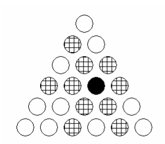
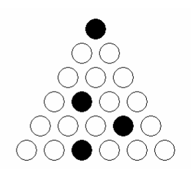

## 문제

한 변에 N칸이 있는 삼각형 모양의 체스판이 있다. 이 체스판에서 퀸은 변과 평행하면서 퀸을 포함하는 줄의 모든 칸을 공격할 수 있다. 예를 들어, 아래 그림에서 검정색 칸이 퀸일때, 퀸이 공격할 수 있는 칸을 표시해 놓은 것이다.

삼각 N-Queen 문제는 한 변에 N칸이 있는 삼각형 체스판에서 퀸을 서로 공격할 수 없게 최대한 배치하는 것이다. 아래 그림은 N=6일때, 퀸을 서로 공격할 수 없게 최대한 배치한 것이다.

삼각형 한 변의 칸의 수가 N이면, 항상 floor((2\*N+1)/3)개의 퀸을 서로 공격할 수 없게 배치할 수 있다.

N이 주어졌을 때, 삼각 N-Queen문제를 푸는 프로그램을 작성하시오.

## 입력

첫째 줄에 테스트 케이스의 개수 C(1 ≤ C ≤ 1000)가 주어진다. 각 테스트 케이스는 N(1 ≤ N ≤ 1000)을 포함하고 있으며, 한 줄로 이루어져 있다.

## 출력

각 테스트 케이스에 대해서, 첫 줄에 놓을 수 있는 퀸의 최대 개수를 출력한다. 둘째 줄부터 N개의 줄에는 퀸의 위치를 출력한다. 제일 윗 줄의 번호는 1이고, 그 줄의 가장 왼쪽 칸의 번호는 1이다. 위치는 줄 번호와 열 번호를 공백으로 구분해서 한 줄에 하나씩 출력하면 된다. 가능한 배치가 여러 가지인 경우에는 아무거나 출력하면 된다.
