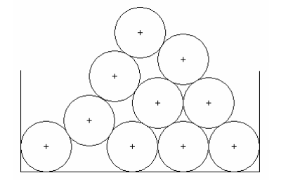

## 문제

드럼통을 직사각형 쓰레기통에 예쁘게 쌓아보려고 한다. 아랫줄을 제외한 모든 실린더는 항상 자기 바로 아랫줄의 실린더 2개와 닿아있다. 가장 밑 줄의 실린더는 쓰레기통 벽에 닿아있기 때문에, 더이상 굴러가지 않는다. 마지막줄을 제외한 모든 줄은 자기 아랫줄의 드럼통 개수보다 하나 적은 드럼통이 있다.

드럼통의 반지름은 항상 1이다.

가장 위에 있는 실린더의 중심 좌표를 구하는 프로그램을 작성하시오. 값을 계산할 때, double을 사용하면 된다.

## 입력

첫째 줄에 테스트 케이스의 개수 T(T<=1,000)가 주어진다. 각 테스트 케이스는 한 줄로 구성되어 있다. 첫 번째 숫자는 드럼통의 개수 N이 주어진다. 이어서 들어오는 N개의 숫자는 각 드럼통의 중심 x좌표이다. (드럼통의 바닥과 접하므로 y좌표는 항상 1이다). N은 1보다 크거나 같고, 10보다 작거나 같다.

인접한 두 드럼통의 중심거리는 적어도 2.0이고, 많아야 3.4이다. (2.0인 이유는 드럼통이 겹치지 않기 위해서, 3.4인 이유는 k줄에 있는 드럼통과 k-2줄에 있는 드럼통이 서로 접하지 않게 하기 위해서)

## 출력

각 테스트 케이스에 대해 한 줄에 하나씩 가장 위에 있는 드럼통의 중심좌표를 공백으로 구분하여 x좌표와 y좌표 순서대로 소수점 4자리까지 출력한다.
