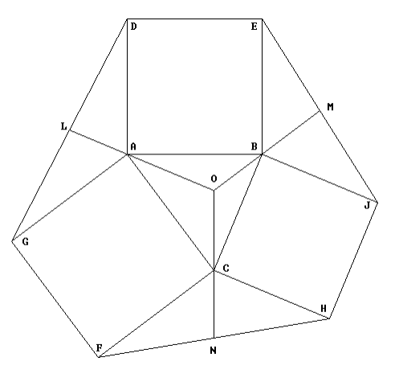

## 문제

삼각형 ABC가 주어졌을 때, 이 삼각형의 바깥 삼각형은 다음과 같이 만들 수 있다.

ABC의 각 변에서 다음과 같은 정사각형(ABDE, BCHJ, ACFG)을 만든다. 인접한 정사각형의 꼭짓점을 아래와 같이 연결하면 세 개의 바깥 삼각형(AGD, BEJ, CFH)을 만들 수 있다.

삼각형 ABC의 바깥 중선이란, 각 바깥 삼각형의 중선 중 ABC의 꼭짓점을 통과하는 중선을 ABC 내부까지 연장한 선이다. (아래 그림에서 LAO, MBO, NCO)

바깥 삼각형의 중심이란 삼각형 ABC의 바깥 중선이 교차하는 점(그림에서 점 O)이다.

삼각형이 주어졌을 때, 바깥 삼각형의 중심을 구하는 프로그램을 작성하시오.

## 입력

첫째 줄에 테스트 케이스의 개수 T가 주어진다. 각 테스트 케이스는 삼각형 ABC의 세 점의 좌표로 이루어져 있고, 한 줄에 한 점의 정보가 주어진다. 겹치는 점이나, 삼각형을 만들지 못하는 경우는 없다.

## 출력

각 테스트 케이스에 대해서 바깥 삼각형의 중심의 x좌표와 y좌표를 소수 넷째자리까지 출력한다.
