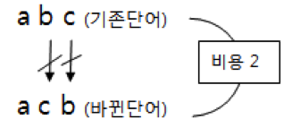
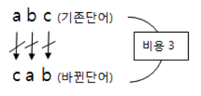

## 문제

규현이와 진우는 둘만의 비밀이 있다. 그 비밀은 절대로 둘 외에는 알아서는 안되기 때문에 무조건 말이 아닌 글로 대화하기로 했다. 그리고 그것도 모자라서 둘은 자신들만의 비밀 어를 만들기로 결심했다. 그리고 비밀 어는 비용을 들여서 단어 내의 글자 위치를 바꿀 수 있다. 단어를 바꾸는 비용은 기존 단어와 바꾼 단어에서 글자가 다른 위치의 수이다.

만약 abc라는 비밀 단어가 있다고 하자. 그렇다면 비용을 들여서 다음과 같은 단어를 비밀 어로 사용할 수 있다.

* 비용 0 : abc
* 비용 2 : acb, cba, bac
* 비용 3 : cab, bca

비밀 어와 비밀 어의 합은 비밀 문장이 될 수 있다.  예를 들어 ab와 dc라는 비밀 어가 있을 경우 abdc라는 비밀 문장이 만들어 질 수 있다. 만약 하나의 비밀 어가 문장에 여러 번 등장할 경우 각각은 다르게 변형되어 사용 될 수 있다. 즉, 주어진 단어가 위처럼 되어 있을때 abcacb라는 문장을 만들 수 있다는 것이다. ( 비용을 들이지 않고 abc단어를 사용하고 비용 2를 들여 acb단어를 사용하여 이 문장을 만들 수 있다. 이때 총 비용은 2이다.)

이렇게 비밀 어에서는 특정 문장을 만들기 위해 주어진 비밀 어를 비용을 들여서 글자 위치를 바꾼 후 접합 시킬 수 있다. 이는 하나의 문장을 만드는 방법이 여러 개가 있을 수 있음을 의미한다.  우리는 규현이와 진우의 비밀 문장 하나를 얻었다. 주어진 비밀 어들을 이용하여 비밀 문장을 만들기 위해 필요한 최소의 비용을 구해보자. 만약 문장을 만들 수 없다면 -1을 출력하라.

## 입력

첫 번째 줄에 Test case의 수 T가 주어진다. 그리고 각각의 케이스마다 입력으로 첫 번째 줄에  우리가 만들어야하는 비밀문장 하나가 주어진다. 이 비밀문장은 ‘a’~’z’까지의 문자만 사용하여 만들어져있으며 길이는 1~50글자이다. 둘째 줄에 비밀어에서 사용하는 단어의 개수 N이 주어진다. (N은 1 <= N <= 50 인 자연수) 다음줄부터 N개의 줄만큼 비밀 어가 각각의 줄에 하나씩 주어진다.

## 출력

각각의 Test case에 대해서 주어진 비밀 문장을 만드는데 필요한 최소의 비용을 출력하라. 만약 만들 수 없다면 -1을 출력하라.
