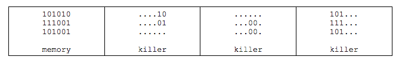

## 문제

상근이는 프로그램을 디버깅할 때, 버그와 프로그램 메모리에서 정사각형 킬러가 깊은 관계가 있다는 것을 알게 되었다.

프로그램 메모리는 1과 0으로만 이루어진 R행 C열 행렬로 이루어져 있다.

정사각형 킬러란 프로그램 메모리에서 한 글자보다 많은 문자로 이루어진 정사각형 부분 행렬 중에서, 180도 돌렸을 때와 원래 부분 행렬이 같은 것이다.

예를 들어, 프로그램 메모리가 아래 그림과 같을 때, 정사각형 킬러는 3가지가 있다.

상근이는 가장 큰 정사각형 킬러의 크기와 버그 사이의 관계가 궁금해졌다. 프로그램 메모리가 주어졌을 때, 가장 큰 정사각형 킬러의 크기를 구하는 프로그램을 작성하시오. 정사각형 킬러의 크기는 부분 행렬의 행의 개수 또는 열의 개수와 같다. 위의 그림에서 정사각형 킬러의 크기는 순서대로 2, 2, 3이다.

## 입력

첫째 줄에 300보다 작거나 같은 자연수 R과 C가 주어진다. 다음 R개의 줄에는 C개의 문자(0 또는 1)가 공백없이 주어진다.

## 출력

첫째 줄에 가장 큰 정사각형 킬러의 크기를 출력한다. 만약 정사각형 킬러가 없다면 -1을 출력한다.
