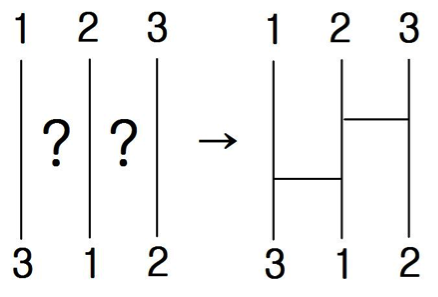

## 문제

상덕이는 매일 점심시간마다 무엇을 먹어야 할 지 매우 고민에 빠진다. 결국 상덕이는 사다리게임을 하기로 했다. 밥을 같이 먹는 희원이는 상덕이를 놀리고 싶은 마음에, 희원이가 원하는 대로 사다리를 그리고 싶어한다.

희원이는 상덕이를 잘 속이기 위해서, 가장 적은 가로줄로 사다리를 빨리 그리려고 한다.

예를 들어, 아래와 같은 사다리를 보자. 희원이는 이 사다리의 1번 시작점은 2번째 도착점으로, 2번 시작점은 3번째 도착점으로, 3번 시작점은 1번째 도착점으로 도착하게 가로줄을 그리려고 한다. 이때, 아래 그림과 같이 두 개의 가로줄을 그리면, 희원이가 원하는 대로 사다리를 그릴 수 있고, 이것이 최솟값이 된다.

단, 희원이가 그리는 가로줄 중 같은 높이에 그리는 가로줄은 없다.

|  |  |
| --- | --- |
|  |  |
| 가능한 경우 | 불가능한 경우 |

희원이가 원하는 대로 사다리를 그리는데 필요한 가로줄 개수의 최솟값을 구하는 프로그램을 작성하시오.

## 입력

입력은 T개의 테스트 데이터로 구성된다. 입력의 첫 번째 줄에는 입력 데이터의 수를 나타내는 정수 T가 주어진다. 각 테스트 데이터는 두 줄로 구성되어 있다. 첫 번째 줄에는 사다리 세로줄의 개수 N이 주어진다. 둘째 줄에는 1번 도착점으로 도착하는 시작점의 번호, 2번 도착점으로 도착하는 시작점의 번호, …, N번 도착점으로 도착하는 시작점의 번호가 공백으로 구분되어 주어진다. N은 1,000보다 작거나 같은 자연수이다.

## 출력

각 테스트 데이터에 대해, 가장 적은 가로줄의 개수를 출력한다.
