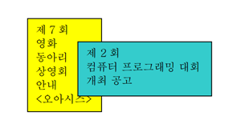

## 문제

가을 축제를 맞아 영화 동아리의 상원은 과 게시판에 동아리 상영회 포스터를 붙였다. 잠시 후에 와 보니 다른 동아리 사람이 그 위에 다른 행사 포스터를 붙여 일부분이 가려서 보이지 않는 것이다. 동아리 간에는 다른 포스터를 절반 이상은 가릴 수 없도록 되어 있기에 보이는 부분의 넓이를 계산해보고 따지러 가기로 하였다. 포스터는 둘 다 직사각형이며, 게시판 벽에 평행하게 붙어있다고 하자. 각 포스터의 위치는 왼쪽 아래와 오른쪽 위 두 꼭짓점의 좌표로 주어진다.

## 입력

입력의 첫 줄에는 테스트 케이스의 개수 T가 주어진다. 각 테스트 케이스는 한 줄에 8개의 정수 x1, y1, x2, y2, x3, y3, x4, y4가 주어진다. 상원이 처음 붙인 포스터의 두 꼭짓점의 좌표 (x1, y1), (x2, y2)와 그 위에 덧붙은 포스터의 꼭짓점의 좌표 (x3, y3), (x4, y4) 이다. 1 ≤ x1 < x2 ≤ 10,000; 1 ≤ y1 < y2 ≤ 10,000; 1 ≤ x3 < x4 ≤ 10,000; 1 ≤ y3 < y4 ≤ 10,000의 범위를 가진다.

## 출력

각 테스트 케이스에 대해서 보이는 부분의 넓이를 한 줄에 하나씩 출력한다.
