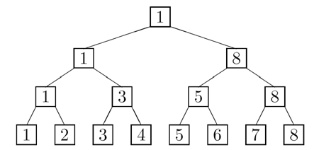

## 문제

2N명의 선수가 토너먼트로 경기를 치른다. 매 시합마다 패자는 떨어져 나가고 승자는 최후의 한 명이 남을 때까지 시합을 계속 한다. 선수들을 1,2,3,⋯,2N 순으로 번호를 매기면 첫 번째 라운드는 번호가 2k-1인 선수와 2k인 선수의 대결이 되고 (1 ≤ k ≤ 2N-1 ) 토너먼트의 결과는 완전 이진 트리로 표현될 수 있다. 이때 리프 노드를 제외한 나머지 노드는 각 시합의 승자를 의미한다. 아래 그림은 n = 3인 토너먼트의 예이다.

토너먼트가 끝난 후 기자들 사이에서 선수들의 순위를 놓고 논쟁이 벌어졌다. A 선수가 B 선수를 이기고 B 선수는 C 선수를 이겼다면 A 선수는 C 선수를 이긴 것으로 간주된다. 1위에 대해서는 이견의 여지가 없다. 문제는 나머지 선수들이 주장할 수 있는 가장 높은 순위와 가능한 가장 낮은 순위는 몇인가 이다. 예를 들어 위 토너먼트의 2번 선수는 우승자에게 졌으므로 자신이 2위라고 주장할 수 있다. 그러나 최악의 경우 최하위(8위)가 될 수도 있다. 5번 선수는 자신이 3위라고 주장할 수 있으며 (2위라고 주장할 수 있는 선수에게 졌으므로) 7위보다 더 낮아질 수는 없다. (첫 번째 라운드에서 한 명의 선수를 이겼으므로) 주어진 토너먼트의 결과에 대하여, 지정된 선수들의 가능한 가장 높은 순위와 가장 낮은 순위를 출력하는 프로그램을 작성하시오.

## 입력

입력의 첫 줄에는 테스트 케이스의 개수 T가 주어진다. 각 테스트 케이스는 세 줄로 구성된다. 첫째 줄에 N(1 ≤ N ≤ 7)이 주어지고 둘째 줄에는 토너먼트의 결과가 첫 번째 라운드부터 시작해서 왼쪽에서 오른쪽 순서대로 빈 칸으로 구분되어 주어진다. 이때 2N은 토너먼트의 참가한 선수의 수이다. 예를 들어 위 토너먼트의 결과는 아래와 같은 입력으로 주어진다.

1 3 5 8 1 8 1

셋째 줄에는 선수들의 수 M, 선수의 번호 p1,⋯,pm가 빈 칸으로 구분되어 주어진다.

## 출력

각 pi에 대해 다음과 같은 형식으로 한 줄에 하나씩 출력한다.

Player pi can be ranked as high as *h* or as low as *l*.

총 M개의 줄이 입력에 주어진 pi의 순서대로 출력되어야 한다. 각 테스트 케이스 사이에는 빈 줄을 출력한다.
