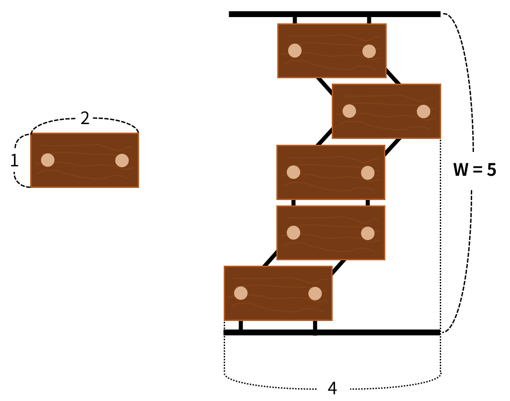

## 문제

너비가 *W*인 강에 목수가 나무토막으로 이루어진 나무 다리를 지으려 한다.

너비가 *W*인 강을 건너기 위한 나무 다리는 위 그림과 같이 가로 길이가 2, 세로 길이가 1인 *W*개의 나무토막을 엮어서 만들며, 원활한 통행을 위해 위아래로 인접한 나무토막과 가로로 겹치는 구간의 길이가 1 또는 2여야 한다.

자기가 짓는 나무 다리가 최대한 커보이기를 바란 목수는 나무 다리의 왼쪽 끝과 오른쪽 끝 사이의 거리가 안전 상 최대 한도인 *L*이 되도록 나무 다리를 만들기로 할 때, 목수가 지을 수 있는 서로 다른 나무 다리 모양의 개수를 출력하는 프로그램을 작성하시오.

이때, 두 다리가 있을 때 지은 위치가 다르더라도 다리 하나를 왼쪽이나 오른쪽으로 평행이동시켜 일치한다면 두 다리는 같은 모양의 다리이다.

## 입력

강의 너비 *W*와 나무다리의 왼쪽 끝에서 오른쪽 끝까지의 거리 *L*이 주어진다.

## 출력

주어진 조건을 만족하는 서로 다른 나무다리 모양의 개수를 109 + 7로 나눈 나머지를 출력한다.
