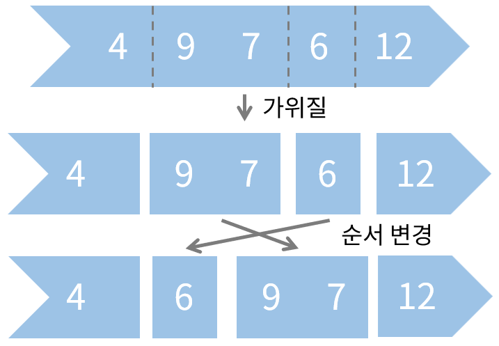
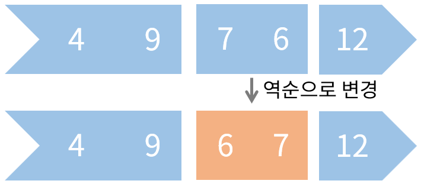

## 문제

숫자가 적힌 종이로 된 띠가 있다. 띠에는 *N*개의 서로 다른 수가 적혀 있다.

이때, 이 띠에 적힌 수 사이에 가위질을 하여 하나의 띠를 여러개의 띠로 분리할 수 있으며, 여러개의 띠가 있을 때 각 띠간의 순서를 자유롭게 바꿀 수 있다.

또한, 각 띠에 대해 띠에 적힌 수를 모두 지우고 원래 적혀있던 수의 역순으로 수를 적을 수 있다.

띠에 적힌 수가 주어질 때, 띠에 적힌 수를 왼쪽부터 오름차순으로 정렬된 상태로 표시하기 위해 필요한 최소한의 가위질 횟수를 구하는 프로그램을 작성하시오.

## 입력

첫 번째 줄에 띠에 적힌 수의 개수 *N*이 주어진다.

두 번째 줄에 왼쪽부터 순서대로 띠에 적힌 수 a1, a2, … aN이 주어진다.

## 출력

띠에 적힌 수들을 왼쪽부터 오름차순으로 표시하기 위해 필요한 가위질 횟수의 최솟값을 출력한다.
