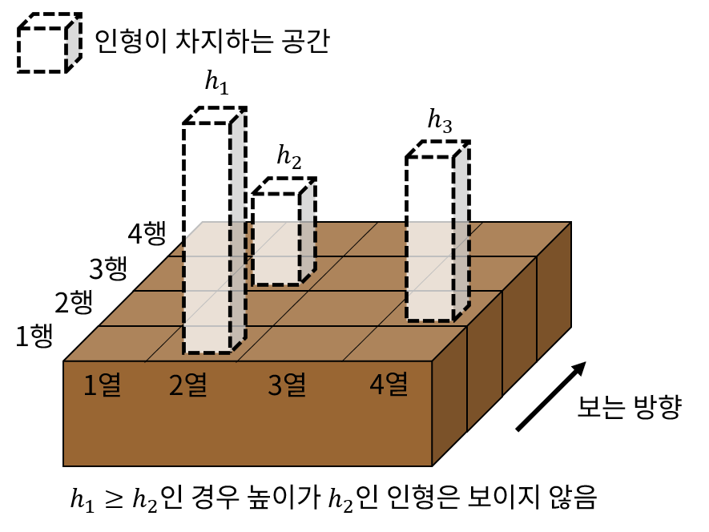

## 문제

탁자 위에 인형을 전시하려고 한다. 탁자는 위에서 보았을 때 *R*개의 행과 *C*개의 열을 가진 *R* × *C*개의 칸을 가진 2차원 배열이며, 각 칸에 하나의 인형을 전시할 수 있다. 현재 전시할 수 있는 인형은 N개이며, 탁자 위에 N개의 인형을 모두 전시할 필요는 없다.

탁자를 정면으로 보면 1행에 놓은 인형들이 맨 앞쪽에 있는 방향으로 보게 되는데, 같은 열에 있는 인형들에 대해 앞쪽 행에 인형을 놓은 경우 앞쪽 인형보다 뒤쪽 행에 있고 높이가 앞쪽 인형의 높이 이하인 인형은 앞쪽 인형에 가려져 보이지 않게 된다.

이때, 탁자에 인형들을 적당히 배치했을 때 탁자의 정면 방향에서 보이는 인형의 개수의 최댓값을 구하는 프로그램을 작성하시오.

## 입력

첫 번째 줄에 탁자의 행의 개수 *R*과 열의 개수 *C*가 주어진다.

두 번째 줄에 탁자에 전시할 수 있는 인형의 개수 *N*이 주어진다.

세 번째 줄에 *N*개의 인형의 높이 h1, h2, …, hN이 주어진다.

## 출력

탁자의 정면 방향에서 보이는 인형의 개수의 최댓값을 출력한다.
