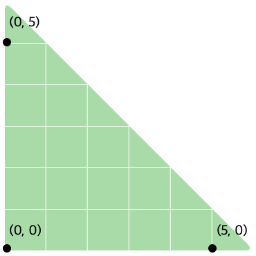

## 문제

왼쪽 아래의 각이 직각인 직각이등변삼각형 모양의 정원이 있다. 정원의 왼쪽 아래 꼭지점의 좌표를 (0, 0)이라 하고, 길지 않은 변의 길이를 *R*이라고 하자. 다음은 `R = 6`인 정원의 모습이다.

정원에 트릭 플라워를 심으면 1초가 지날 때마다 한 송이씩 새로운 꽃이 피어난다. 트릭 플라워의 좌표를 (x0, y0)라 하고, t초가 지났을 때 피어나는 꽃의 좌표를 (xt, yt)라고 하자. 좌표 (xt, yt)를 알고 있다면 (xt + 1, yt + 1)는 다음과 같이 알아낼 수 있다.

* 부등식 (xt + 1) + (yt + 1) < *R* 이 참이라면 xt + 1과 yt + 1은 각각 xt + 1, yt + 1 이다.
* 그렇지 않다면 xt + 1과 yt + 1은 각각 xt ÷ 2, yt ÷ 2 이다.
* 단 계산 과정에서 소수점은 모두 버리며, 여러 송이의 꽃이 한 좌표에 필 수도 있다.

비어있는 정원에서 좌표 (*a*, *b*)에 트릭 플라워를 심었을 때, 적어도 몇 초가 지나야 한 좌표에 두 송이의 꽃이 피어있게 되는지 알아보자. 특히 트릭 플라워도 꽃으로 취급하며, 트릭 플라워로 인해 피어나는 꽃은 모두 트릭 플라워가 아닌 일반적인 꽃이다.

## 입력

첫째 줄에 *a*와 *b*가 공백을 구분으로 주어진다.

둘째 줄에 *R*이 주어진다.

## 출력

비어있는 정원에서 좌표 (*a*, *b*)에 트릭 플라워를 심었을 때 적어도 몇 초가 지나야 한 좌표에 두 송이의 꽃이 피어있게 되는지 출력한다.
