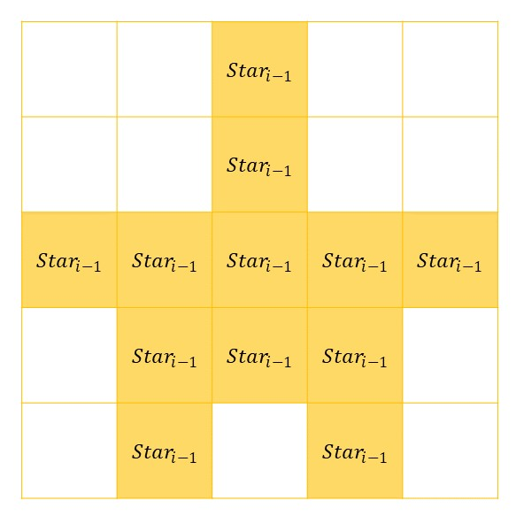

## 문제

규칙에 따라 별을 찍어보자.

먼저 $Star\_0$는 별이 하나만 있는 패턴이다.

```

*
```

그리고 양의 정수 $i$에 대하여 $Star\_i$의 패턴은 다음과 같다. 빈칸은 공백으로 채워져야 한다.



정수 $N$이 주어질 때 $Star\_N$을 출력해 보도록 하자.

## 입력

정수 $N$이 주어진다. $(0 \leq N \leq 5)$

## 출력

$Star\_N$을 출력한다. 모든 공백을 출력해야 함에 유의한다.
