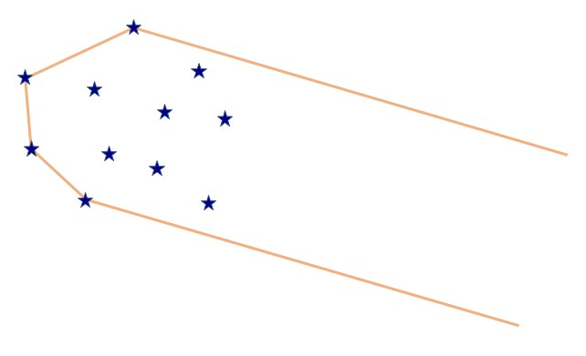
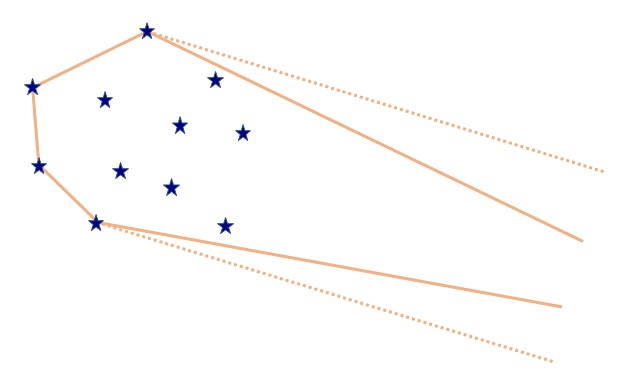
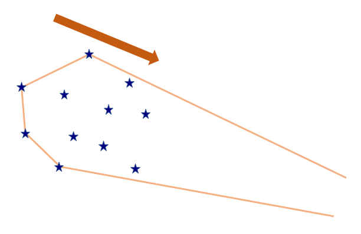
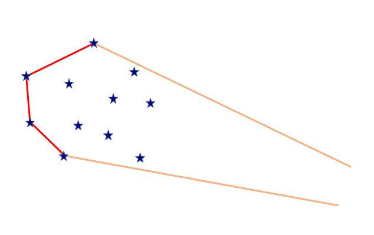

## 문제

스타는 밧줄을 사용해서 별을 포획하려고 한다. 포획 과정은 다음과 같다.

1. 밧줄로 포획하려는 모든 별을 감싼 뒤 팽팽하게 당긴다. 이때, 별과 별 사이에 걸린 밧줄의 부분은 팽팽해야 하며, 스타가 잡고 있는 밧줄 부분은 서로 평행하게 하면서 만나지 않도록 한다.

   
2. 1.에서 밧줄에 닿은 별들을 제외하고 나머지 별들은 밧줄에 닿지 않을 정도로만 밧줄을 잡은 채로 양손을 가까이 당긴다.

   
3. 있는 힘껏 잡아당긴다.

   

별들을 포획하다 보면 밧줄에 무리가 가서 끊어질 수 있어 밧줄의 부담을 최소화하여 별들을 포획하려고 한다. 어떻게 해야 밧줄의 부담을 줄일 수 있을지 고민하던 스타는 2.에서 별과 별 사이에 걸린 밧줄의 길이의 합이 작을수록 밧줄의 부담이 줄어든다는 것을 알아냈다.

그럼, 이제 별과 별 사이에 걸린 밧줄의 길이의 합을 최소화하면 된다. 어느 정도까지 길이의 합을 줄일 수 있을지 구해보자.

## 입력

첫째 줄에는 포획하려는 별의 개수 $N$이 정수로 주어진다. $(2 \leq N \leq 100 \, 000)$

둘째 줄부터 $N$개의 줄에 걸쳐 각 별들의 위치 $x\_i, y\_i$ 가 공백을 사이에 두고 한 줄에 하나씩 주어진다. $x\_i, y\_i$는 정수이다. 같은 위치에 두 개 이상의 별이 존재하는 경우는 없다. $(-3 \, 000 \, 000 \leq x\_i, y\_i \leq 3 \, 000 \, 000)$

## 출력

별과 별 사이에 걸린 밧줄 길이의 최솟값을 출력한다.

절대/상대 오차는 $10^{-6}$까지 허용한다.
