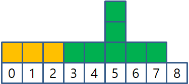
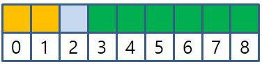

## 문제

성현이는 바나나 푸딩을 만들기 위해 먼저 버터를 녹이려고 한다. 이를 위해 양쪽으로 무한히 뻗은 직선 모양의 프라이팬에 각각 홀수 높이의 버터 $N$개를 올려놓고, 열을 가해서 버터를 녹인다. 위치가 $x$인 곳에 올려진 버터는 처음에 구간 $[x,x]$를 차지하고, 열을 가하면 처음 버터가 올려진 부분의 높이가 1이 될 때까지 1초에 좌우로 1씩 퍼지게 된다. 즉, $[L,R]$이었던 버터는 1초 후 $[L-1,R+1]$를 차지하게 된다. 다음 예시는 위치 $x=5$, 높이 $h=7$인 버터가 녹는 과정이다.

|  |  |  |  |  |  |  |  |  |  |  |
| --- | --- | --- | --- | --- | --- | --- | --- | --- | --- | --- |
|  | **0** | **1** | **2** | **3** | **4** | **5** | **6** | **7** | **8** | **9** |
| **0초** | 0 | 0 | 0 | 0 | 0 | 7 | 0 | 0 | 0 | 0 |
| **1초** | 0 | 0 | 0 | 0 | 1 | 5 | 1 | 0 | 0 | 0 |
| **2초** | 0 | 0 | 0 | 1 | 1 | 3 | 1 | 1 | 0 | 0 |
| **3초** | 0 | 0 | 1 | 1 | 1 | 1 | 1 | 1 | 1 | 0 |
| **4초** | 0 | 0 | 1 | 1 | 1 | 1 | 1 | 1 | 1 | 0 |

이때 서로 다른 두 버터가 녹아서 섞이게 될 수 있다. 두 버터가 섞인다는 것은, 두 버터가 각각 $[l\_1,r\_1]$와 $[l\_2,r\_2]$에 놓였을 때 겹치는 구간이 생기는 것을 의미한다. 즉, $[l\_1,r\_1] \cap [l\_2,r\_2] \neq \emptyset$ 인 경우이다. 다음은 예제 1번의 상황을 그림으로 나타낸 것이다.

2초의 상황으로 두 버터가 섞이지 않는다.

3초까지 가열하면 $x=2$에서 섞이게 된다.

성현이는 어떤 두 버터도 섞이지 않을 때까지만 버터를 녹이고 싶다. 그러나 성현이는 정수 시간만큼만 가열할 수 있다. 즉, 3초나 4초를 가열할 수는 있지만, 3.5초나 3.105초를 가열할 수는 없다. 직선 모양의 프라이팬에 처음 버터를 놓은 위치 $x$와 버터의 높이 $h$가 $N$개 주어졌을 때, 성현이가 얼마나 오랜 시간 버터를 가열할 수 있는지 알아보자.

## 입력

입력은 다음과 같이 주어진다.

$N$

$x\_1$ $h\_1$

$x\_2$ $h\_2$

$\cdots$

$x\_{N-1}$ $h\_{N-1}$

$x\_N$ $h\_N$

첫째 줄에 성현이가 올린 버터의 수 $N$이 주어진다.

이어 $N$개의 줄에 걸쳐 버터가 놓인 좌표 $x\_i$와 버터의 높이 $h\_i$가 공백으로 구분되어 주어진다.

## 출력

성현이가 얼마나 오랜 시간 버터를 가열할 수 있는지 출력한다. 만약 성현이가 $10^{100}$초 이상 가열할 수 있다면, `forever`를 출력한다.
