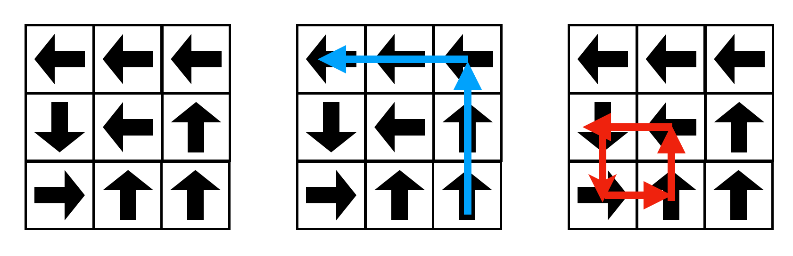
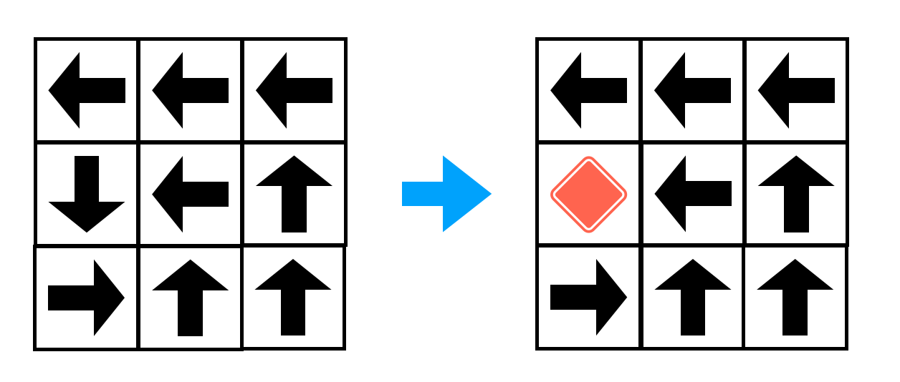

## 문제

각 칸에 '상', '하', '좌', '우' 중 하나가 표시되어 있고 세로로 $N$칸, 가로로 $M$칸인 $N \times M$ 크기의 미로가 있다. 해당 칸으로 도착한 모든 사람은 미로에 표시된 방향으로 한 칸 이동한다. 이를 반복해 미로 밖으로 벗어나면 미로에서 탈출할 수 있다.

해당 그림의 파란색 경로는 미로에서 탈출하는 예시이다. 하지만 운이 나쁘다면 그림의 빨간색 경로와 같이 영원히 미로에서 탈출하지 못할 수도 있다! 영원히 탈출하지 못하는 상황을 막기 위해, 형진이는 미로를 보수하기로 했다.

형진이는 미로에 원하는 만큼 점프대를 설치할 수 있다. 점프대를 설치하면 해당 위치에 도착한 사람들은 점프를 통해 바로 미로 밖으로 빠져나올 수 있다.

점프대를 설치하기 위해서는 해당 칸의 지리적 조건 등을 고려해야 하므로, 어느 칸에 설치하냐에 따라 점프대의 비용이 달라진다. 정확하게는 $i$행 $j$열의 칸에 점프대를 설치하는 것은 $Cost\_{i,j}$ 만큼의 비용이 필요하다.

주어진 미로에서 최소한의 비용을 사용해 점프대를 설치해, 미로의 어느 칸에서 시작하더라도 탈출할 수 있도록 만들고 싶다. 필요한 최소한의 비용을 구해보자.

## 입력

입력은 다음과 같이 주어진다.

$N$ $M$

$B\_{1,1}$$B\_{1,2}$ $\cdots$ $B\_{1,M}$

$B\_{2,1}$$B\_{2,2}$ $\cdots$ $B\_{2,M}$

$\cdots$

$B\_{N,1}$$B\_{N,2}$ $\cdots$ $B\_{N,M}$

$Cost\_{1,1}$ $Cost\_{1,2}$ $\cdots$ $Cost\_{1,M}$

$Cost\_{2,1}$ $Cost\_{2,2}$ $\cdots$ $Cost\_{2,M}$

$\cdots$

$Cost\_{N,1}$ $Cost\_{N,2}$ $\cdots$ $Cost\_{N,M}$

첫째 줄에 미로의 행의 수 $N$, 열의 수 $M$이 공백을 사이에 두고 주어진다.

이어 $N$개의 줄에 걸쳐 미로판 $B$를 표현한 길이가 $M$인 문자열이 주어진다. 문자열은 대문자 알파벳 `U`, `D`, `L`, `R`만으로 이루어져 있다. 각각의 알파벳은 '상', '하', '좌', '우'를 뜻한다.

이어 $N$개의 줄에 걸쳐 미로의 각 칸에서 점프대를 설치하는 비용 정보 $Cost$가 공백을 사이에 두고 주어진다.

## 출력

미로의 어느 칸에서 시작하더라도 탈출할 수 있도록 하는 최소 비용을 출력한다.
