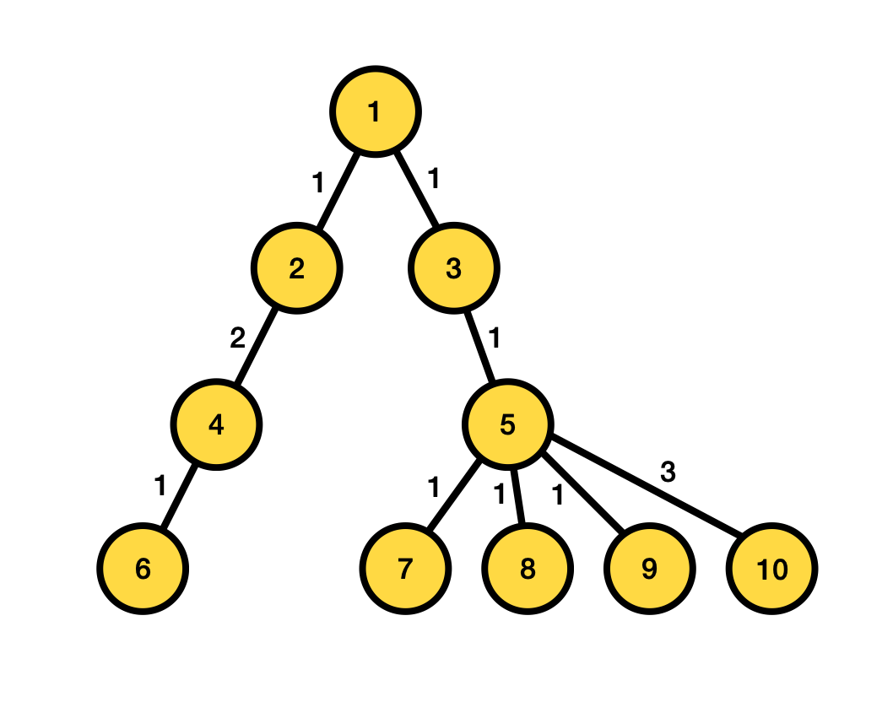
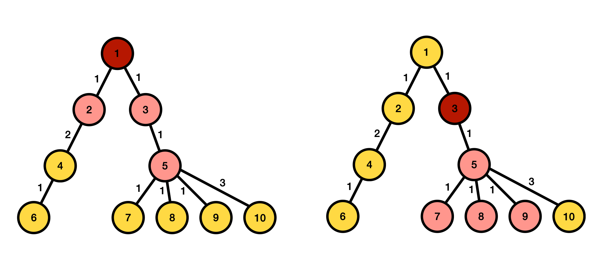

## 문제

트리 문제만 공부하다 정신이 돌아버린 형진이는, 트리를 뽀개기로 결정하였다.

여기 $N$개의 정점으로 이루어진, 간선에 가중치가 있는 트리가 있다. 이 트리는 항상 1번 노드가 트리의 루트가 된다.

형진이는 슈퍼 트리 뽀개기를 1회 사용하여 이 트리를 뽀갤 수 있다. 트리의 특정 노드를 하나 선택한 후, 그 노드부터 거리가 $K$ 이하에 있는 손자 노드 모두를 뽀개버린다.

노드 사이의 거리는 다음과 같이 정의된다.

* 노드 $u$와 $v$ 사이의 거리는, 노드 $u$에서 노드 $v$까지의 단순 경로에 포함되는 간선의 가중치의 총합이다.

손자 노드는 다음과 같이 정의된다.

* 루트까지의 단순 경로에 $v$가 포함되는 모든 노드는 노드 $v$의 손자 노드이다.

다음은 $K$ = 2일 때 트리를 뽀개는 예시이다. 왼쪽의 경우 1번 노드를 선택해 슈퍼 트리 뽀개기를 진행했고, 오른쪽의 경우 3번 노드를 선택해 슈퍼 트리 뽀개기를 진행했다. 각각 4, 5개의 노드가 뽀개졌다.

형진이는 최대한 많은 노드를 뽀개고 싶다. 형진이를 도와 최대한 많은 노드를 뽀갰을 때 몇 개의 노드를 뽀갤 수 있는지 구해보자.

## 입력

입력은 다음과 같이 주어진다.

$N$ $K$

$a\_1$ $b\_1$ $c\_1$

$a\_2$ $b\_2$ $c\_2$

$\cdots$

$a\_{N-1}$ $b\_{N-1}$ $c\_{N-1}$

첫째 줄에 트리 노드의 개수 $N$, 뽀갤 수 있는 손자 노드의 거리 $K$가 공백을 사이에 두고 주어진다.

두 번째 줄부터 $N - 1$개의 줄에 걸쳐 간선에 연결된 두 노드의 번호 $a\_i$, $b\_i$, 그리고 해당 간선의 가중치 $c\_i$가 공백을 사이에 두고 주어진다.

## 출력

슈퍼 트리 뽀개기를 통해 최대한 많은 노드를 뽀갤 때 몇 개의 노드를 뽀갤 수 있는지 출력한다.
