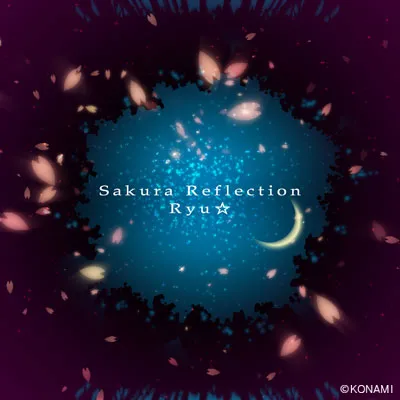
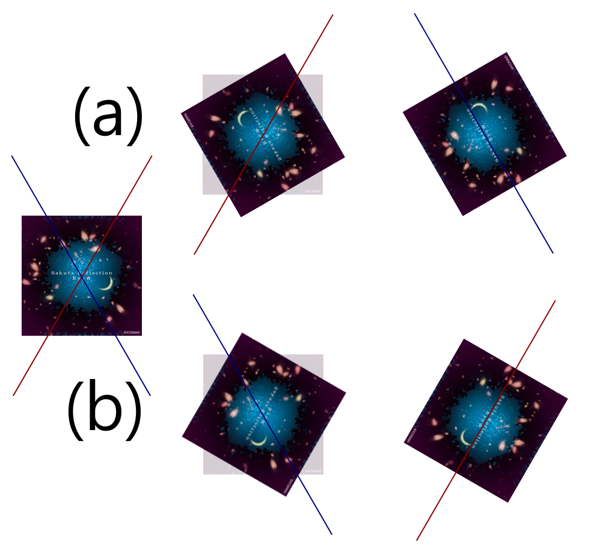

## 문제

Ryu☆ - Sakura Reflection의 앨범아트

*Sakura Reflection*은 Ryu☆가 작곡해 REFLEC BEAT에 수록된 곡이다. 이제, 제목이 말하는 대로 앨범아트를 *Reflection*하자. 앨범아트의 중심을 지나는 $N$개의 축이 주어지며, $i$번째 축이 수평선과 이루는 각도는 시계 반대 방향으로 $A\_i^{\circ}$이다. 이제 각 축을 기준으로 앨범아트를 대칭이동할 수 있다. 앨범아트를 $360^{\circ}$의 배수가 아닌 각도로 회전하거나, 특정한 축을 기준으로 한 번 대칭이동하는 것으로는 앨범아트가 원래 상태가 되지 않는 점에 유의하여라.

Ryu☆는 $N$개의 축을 각각 한 번씩 사용해서 앨범아트를 $N$번 대칭이동하려고 한다. 혹독한 대칭이동의 세계에서는 대칭이동하는 순서에 따라 결과가 다르게 나올 수 있다. (a)는 $60^{\circ}$ 축으로 대칭이동한 후 $120^{\circ}$ 축으로 대칭이동한 그림이며, (b)는 $120^{\circ}$ 축으로 대칭이동한 후 $60^{\circ}$ 축으로 대칭이동한 그림이다.

두 가지 대칭이동 순서. 순서에 따라 다른 결과가 나올 수 있다.

$N$개의 축을 각각 정확히 한 번 사용해서 대칭이동해서 앨범아트를 원래 상태로 만들 수 있는가? 가능하다면, 그 순서를 하나 찾아보자.

## 입력

첫째 줄에 축의 수 $N$이 주어진다. $(1 \le N \le 500)$

다음 줄에 축이 수평선과 이루는 각도를 의미하는 $A\_1, A\_2, \cdots, A\_N$이 공백으로 구분되어 주어진다. $(0 \le A\_i \le 179)$

입력으로 주어지는 모든 수는 정수이다.

## 출력

첫째 줄에 주어진 축을 이용하여 그림을 원래 상태로 만드는 것이 가능하면 `YES`, 아니면 `NO`를 출력한다.

만약 앨범아트를 원래 상태로 만드는 것이 가능하다면 다음 줄에 대칭이동한 축의 번호를 의미하는 $N$개의 정수 $i\_1, i\_2, \cdots, i\_N$을 대칭이동한 차례로 공백으로 구분하여 출력한다. $i\_1, i\_2, \cdots, i\_N$은 서로 다른 $1$ 이상 $N$ 이하의 정수여야 하며, $i\_1, i\_2, \cdots, i\_N$번째 축을 차례로 사용하여 대칭이동했을 때, 앨범아트가 원래 상태가 되어야 한다.
