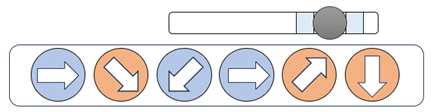
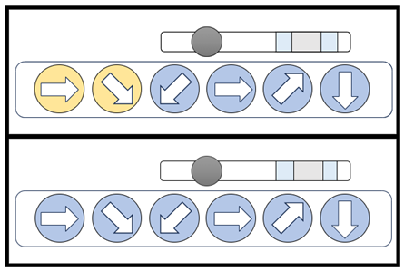
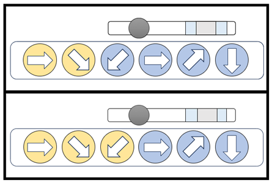
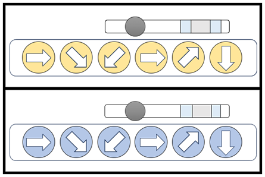

## 문제

가희는 클럽 오디션 모드 중 8키 일반 모드를 플레이하고 있습니다. 이 모드는 여러 레벨의 노트가 나옵니다. 레벨이 $n$인 키 노트는 $n$개의 키가 나옵니다. 표시된 순서대로 올바르게 친 후에, 타이밍에 맞게 `Space` 키를 누르면 판정에 따라 점수를 획득합니다.

키는 2가지 종류 중 하나입니다.

* 정방향 키
  + 주어지는 노트와 같은 방향을 의미하는 키를 쳐야 일치한다고 판정합니다.
* 역방향 키
  + 주어지는 노트와 반대 방향을 의미하는 키를 쳐야 일치한다고 판정합니다.

**[그림 1]** 역방향 키가 있는 레벨 6의 키 노트

[그림 1]의 키 노트에서 2번째, 5번째, 6번째 키는 주황색으로 표시되어 있습니다. 이들은 역방향 키를 의미합니다. 군청색으로 표시된 1번째, 3번째, 4번째 키는 정방향 키를 의미합니다. 따라서, 이 키 노트의 방향은 왼쪽에서부터 우, 좌상, 좌하, 우, 좌하, 상이 됩니다. 플레이 하는 유저가 어떤 순서로 키를 쳤는지에 따라, 앞에서부터 몇 개의 키가 일치하는지가 결정됩니다. 즉, 레벨이 $lv$인 키 노트가 나왔을 때, 아래와 같은 알고리즘으로 상태가 결정됩니다.

* 처음 키 노트가 등장하고, 유저가 아무런 키도 입력하지 않았다면 앞에서부터 $0$개의 키와 일치한 상태입니다.
* 앞에서부터 $i$개의 키와 일치한 상태일 때
  + $i=lv$인 경우, 임의의 키가 입력되면 **앞에서부터 $0$개의 키가 일치한 상태**로 전환됩니다.
  + $i \ne lv$인 경우
    - 유저가 입력한 키와 키 노트의 $i+1$번째 키가 일치하다고 판정되면, 앞에서부터 $i+1$개의 키와 일치한 상태가 됩니다.
    - 그렇지 않으면 앞에서부터 $0$개의 키가 일치한 상태로 전환됩니다.

정방향 키 우, 우하, 좌하, 우, 우상, 하 순서대로 나온 레벨 6의 키 노트가 있습니다. [그림 2]부터 [그림 4]에서 키에 채워진 색깔의 의미는 아래와 같습니다.

* 노란색
  + 앞에서부터 일치하는 키
* 파란색
  + 남은 키. **$lv$개의 키가 일치한 상태로 되기 위해** 순서대로 쳐야 하는 키.

**[그림 2]** 키 노트의 상태 #1

[그림 2]의 위는 앞에서부터 2개의 키가 일치한 상태를 의미합니다. 이 상태에서 우 키를 입력하면 [그림 2]의 아래와 같은 상태가 됩니다. 키 노트의 3번째 키인 좌하와 입력한 방향 우가 일치하지 않기 때문입니다.

**[그림 3]** 키 노트의 상태 #2

앞에서부터 2개의 키가 일치한 상태에서 좌하를 의미하는 키를 입력하면, 앞에서부터 3개의 키가 일치하는 상태(그림 3의 아래)가 됩니다. 키 노트의 3번째 키인 좌하와 입력한 방향 좌하가 일치하기 때문입니다.

레벨이 $lv$인 키 노트에 대해, 앞에서부터 $lv$개의 키와 일치한 상태에서 임의의 키를 입력하면, 앞에서부터 $0$개의 키와 일치하는 상태로 바뀌게 됩니다. [그림 4]는 이를 보여줍니다.

**[그림 4]** 키 노트의 상태 #3

`Space` 키는 레벨이 $lv$인 키 노트에 대해 판정을 받을 때 누르게 됩니다. 최종 판정은 아래와 같습니다.

* 타이밍에 맞추어서 `Space` 키를 눌렀을 때
  + 앞에서부터 $lv$개의 키가 일치한 상태이면 성공입니다.
  + 그렇지 않으면 실패합니다.
* 타이밍에 맞지 않게 `Space` 키를 누른 경우 실패합니다.

가희가 쳐야 하는 노트가 주어지고, 해당 노트의 타이밍이 올 때까지 가희가 누른 키가 순서대로 주어집니다. 가희가 해당 노트의 타이밍에 맞추어 `Space` 키를 눌렀을 때, 최종 판정이 성공인지, 실패인지 출력해 주세요.

## 입력

1번째 줄에 레벨이 $lv$인 노트에 대한 정보가 주어집니다. 노트에 있는 키 노트는 아래와 같이 주어집니다.

{`direction`}{`is_reverse`}

* `direction`
  + `W`, `A`, `S`, `D`, `LU`, `LD`, `RU`, `RD` 중 하나로 주어지며, 각각 상, 좌, 하, 우, 좌상, 좌하, 우상, 우하 방향입니다.
* `is_reverse` **(optional)**
  + 역방향 키인 경우 `direction` 뒤에 문자 `!`로 주어집니다. 예를 들어, `W!`로 주어지면, `W`의 반대 방향인 하 방향을 의미합니다.

2번째 줄에 가희가 입력한 키가 주어집니다. 입력한 키는 `W`, `8`, `A`, `4`, `S`, `2`, `D`, `6`, `7`, `1`, `9`, `3` 중 하나로 주어지며, 각각의 키에 대한 설명은 아래와 같습니다.

|  |  |
| --- | --- |
| 방향 | 키 |
| 상 | `W` 또는 `8` |
| 하 | `S` 또는 `2` |
| 좌 | `A` 또는 `4` |
| 우 | `D` 또는 `6` |
| 좌상 | `7` |
| 좌하 | `1` |
| 우상 | `9` |
| 우하 | `3` |

**[표 1]** 유저가 입력한 키와 대응되는 방향

## 출력

입력이 주어진 키 노트에 대해 최종 판정이 성공이면 `Yes`를, 그렇지 않으면 `No`를 출력해 주세요.
