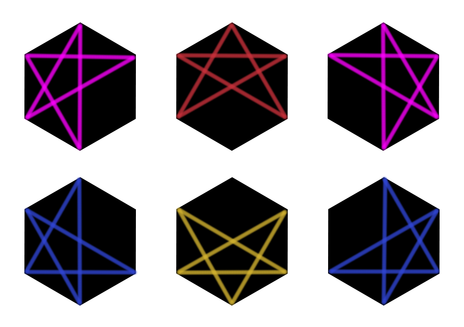

## 문제

곧 시계는 6시, 벌써 첫 번째 별이 보인다. 정$N$각형 모양의 하늘에는 몇 개의 별이 뜰 수 있을까?

정$N$각형의 꼭짓점의 개수 $N$이 주어졌을 때, 정$N$각형의 꼭짓점을 이어 만들 수 있는 서로 다른 별의 개수를 출력하여라.

별은 정$N$각형의 다섯 꼭짓점에 시계 방향으로 번호를 붙였을 때, 그 꼭짓점들을 1-3-5-2-4-1 순으로 연결한 것을 의미한다. 뒤집거나 돌려서 같은 모양이 나오는 별도 정$N$각형의 다른 꼭짓점을 이어 만든 별이라면 서로 다른 별이다.

## 입력

정$N$각형의 꼭짓점의 개수인 정수 $N$이 주어진다. $(5\leq N \leq 100)$

## 출력

정$N$각형의 꼭짓점을 이어 만들 수 있는 별의 개수를 출력한다.

## 힌트

정$6$각형의 꼭짓점을 이어 만들 수 있는 별은 총 $6$가지이다.
