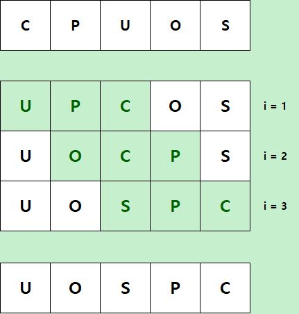

## 문제

양의 정수 $N$, $K$와 영어 알파벳 소문자로 구성된 길이가 $N$인 문자열 $S$가 주어진다.

*reverse(i)*를 $S$의 $i, i+1, ... , i+k-1$번째 문자로 이루어진 부분 문자열을 뒤집는 연산이라고 정의하자.

$i = 1, 2, \cdots , N-K+1$ 의 순서대로 *reverse(i)*을 수행하였을 때 나오는 최종 결과를 건공문자열이라고 할 때, 건공문자열을 출력하여라.

## 입력

첫 번째 줄에 정수 $N$과 $K$가 공백으로 구분되어 주어진다. ($1 \le K \le N \le 500\ 000$)

두 번째 줄에 영어 알파벳 소문자로만 구성되고 길이가 $N$인 문자열 $S$가 주어진다.

## 출력

건공문자열을 출력한다.

## 힌트

