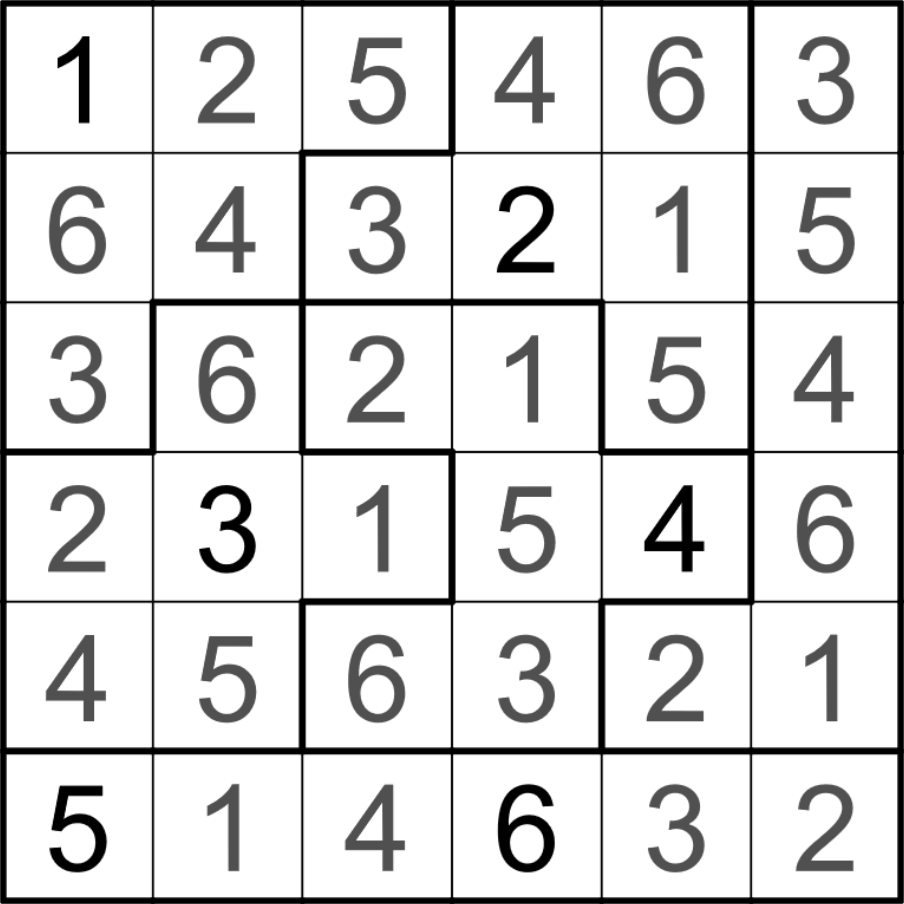

## 문제

Jigsaw Sudoku는 다음 규칙에 맞도록 $N\times N$ 크기의 보드에 $1$ 이상 $N$ 이하의 정수를 적는 퍼즐이다.

* 보드는 $N$개의 구역으로 나누어져 있으며, 각각의 구역은 연결되어 있다. 또한, 서로 다른 두 구역은 겹치지 않는다.
* 같은 가로줄에 있는 서로 다른 두 위치에 적힌 수는 달라야 한다.
* 같은 세로줄에 있는 서로 다른 두 위치에 적힌 수는 달라야 한다.
* 같은 구역에 있는 서로 다른 두 위치에 적힌 수는 달라야 한다.

예로, 다음은 $6\times 6$ Jigsaw Sudoku를 제대로 풀어낸 경우이다.

세훈이는 최근 극악의 난이도를 자랑하는 Jigsaw Sudoku를 풀었고, 이를 노트에 기록했다. 하지만, 실수로 보드에 적힌 수만 기록하고 보드가 어떻게 나뉘어져 있는지를 기록하지 않았다.

세훈이를 위해, 보드에 적힌 수가 주어질 때 가능한 구역의 배치를 찾아주자!

## 입력

첫 번째 줄에 보드의 크기 $N$이 주어진다. $(1\le N\le 50)$

두 번째 줄부터 $N$개의 줄에 걸쳐 세훈이가 보드에 채운 수들이 공백으로 구분되어 주어진다. $i+1$번째 줄의 $j$번째 수는 세훈이가 $i$번 가로줄과 $j$번 세로줄이 교차하는 위치에 적은 수 $A\_{i,j}$를 의미한다.

세훈이는 퍼즐을 잘 풀기 때문에, 가능한 구역의 배치가 항상 존재하는 입력만 들어온다.

## 출력

가능한 구역의 배치를 다음 조건에 맞게 공백으로 구분해 출력한다.

* 출력은 $N$개의 줄로 이루어져야 하며, 각 줄에는 $N$개의 정수가 있어야 한다.
* 출력되는 모든 수는 $1$ 이상 $N$ 이하여야 한다.
* 변을 공유하는 두 칸이 같은 구역에 속한다면, 같은 수로 표현해야 한다.
* 변을 공유하는 두 칸이 다른 구역에 속한다면, 다른 수로 표현해야 한다.
* 변을 공유하지 않는 두 다른 구역은 같은 수로 표현할 수 있다.
* 모든 구역은 문제의 조건을 충족해야 한다.

만일 가능한 구역의 배치가 여러 가지라면, 그중 아무거나 출력한다.
