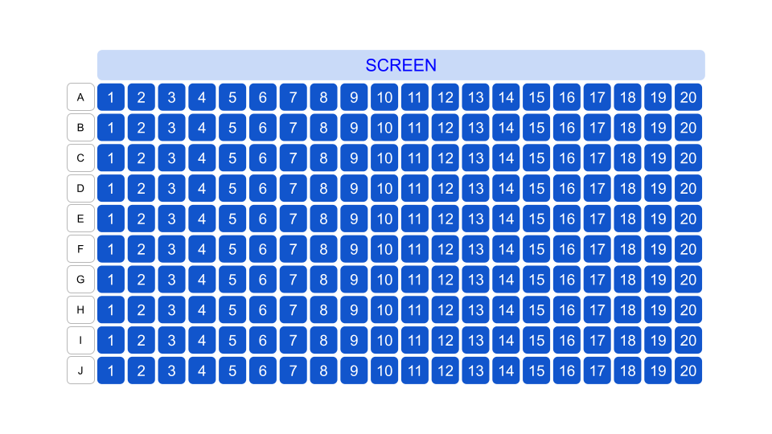

## 문제

희권이는 영화관에서 한 개의 상영관을 담당하고 있다. 상영관의 좌석은 $10\times 20$ 형태이고, 좌석 번호는 다음과 같다.

스크린을 기준으로 맨 앞이 A열, 맨 뒤가 J열이다. 좌석은 가장 왼쪽이 1번, 오른쪽이 20번이다.

갑자기 영화관의 컴퓨터가 고장이 나서 좌석 배치를 알 수 없게 되었다. 다행히 희권이에겐 손님들이 어떤 좌석을 예매했는지 정보가 남아있었다.

어떤 손님의 예매 정보가 A10이라면 A열 10번 좌석을 예매했다는 뜻이다.

희권이를 도와 영화관의 좌석 배치도를 만들어 보자. 단, 좌석이 중복되는 경우는 없다.

## 입력

첫 번째 줄에 영화를 예매한 손님 수 $N$이 주어진다. $(1 ≤ N ≤ 200)$

두 번째 줄부터 $N$줄 동안 각각의 손님이 예매한 좌석의 정보가 주어진다.

## 출력

상영관의 좌석 배치도를 출력한다. 사람이 있는 좌석은 `o`, 없는 좌석은 `.`으로 표기한다.
