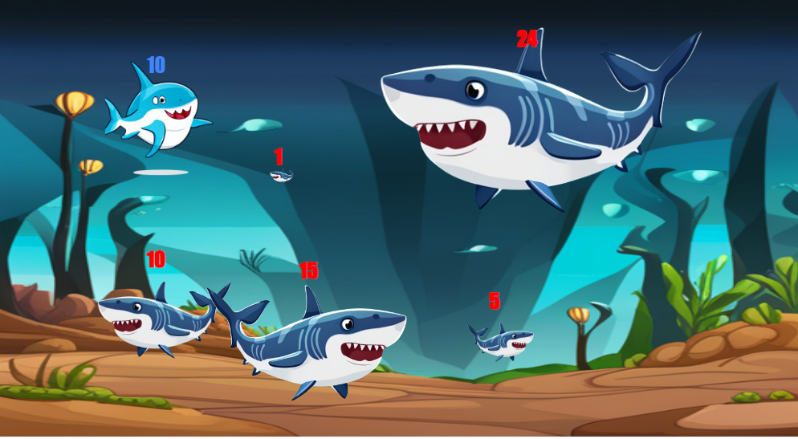

## 문제

인천대학교의 앞바다에는 $N$마리의 상어가 살고 있다고 한다. 각각의 상어는 서로 같거나 다른 크기의 몸집 $A\_i$를 가지고 있다. 상어의 세계는 완전한 약육강식의 세계로, 상어 자신의 크기보다 작은 상어는 전부 먹을 수 있다. 이때, 상어의 크기는 잡아먹힌 상어의 크기만큼 커지게 된다. 반면, 자신의 크기 이상인 상어는 전혀 잡아먹지 못한다.

어느 날 크기가 $T$인 샼이라는 이름의 아기 상어는 인천대학교 앞바다에 존재하는 $N$마리 상어들의 크기 정보를 모두 입수했다. 똑똑한 아기 상어 샼은 인천대학교 앞바다에 있는 상어들을 최대 $K$마리까지 적절한 순서로 잡아먹고, 자신의 몸집을 최대로 키울 계획을 하고 있다.

샼이 최선의 선택으로 최대 $K$마리의 상어를 적절한 순서로 잡아먹었을 때, 몸집이 최대 얼마까지 커질 수 있는지 구해보자.

## 입력

첫째 줄에 인천대학교 앞바다에 존재하는 상어의 마릿수 $N$과, 샼이 먹을 수 있는 상어의 최대 마릿수 $K$, 샼의 최초 크기를 나타내는 정수 $T$가 공백으로 구분되어 주어진다. $(1\le K \leq N \le 200,000, \space 1 \le T \le 10^9)$

둘째 줄에는 인천대학교 앞바다에 존재하는 $N$마리의 상어 크기를 나타내는 정수 $A\_i$가 각각 공백으로 구분되어 주어진다. $(1 \le A\_i \le 10^9)$

## 출력

샼이 최선의 선택으로 최대 $K$마리의 상어를 적절한 순서로 잡아먹었을 때, 몸집이 최대 얼마까지 커질 수 있는지 출력하시오.

정답은 32비트 정수 변수(int) 범위를 초과할 수 있기 때문에 64비트 정수 변수(C/C++ : long long, JAVA : long)를 사용해야 한다.
