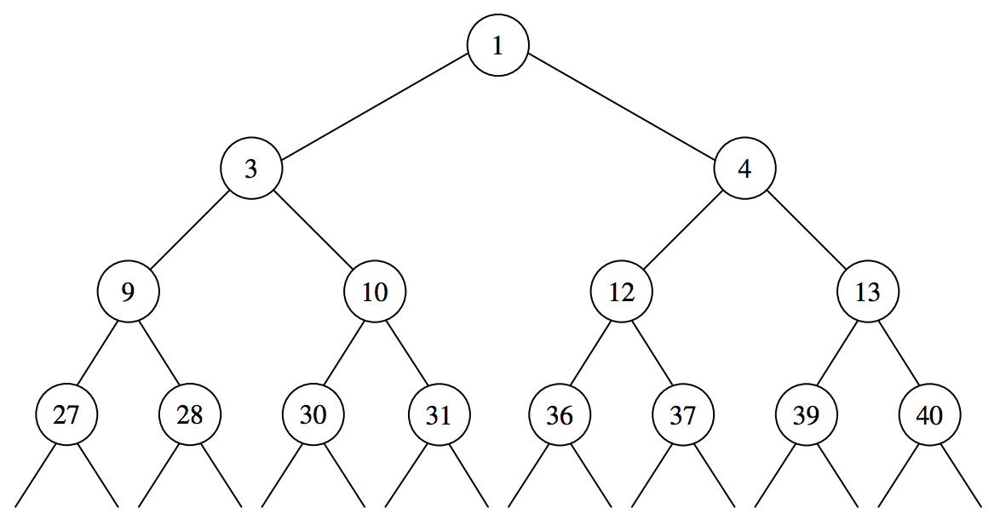

## 문제

p는 2보다 큰 정수이다. 다음과 같은 규칙으로 무한 이진 트리의 각 노드에 정수인 숫자가 매겨진다.

* 루트 노드에는 1을 매긴다.
* 노드에 x가 매겨져 있다면 해당 노드의 왼쪽 자식 노드에는 p \* x, 오른쪽 자식 노드에는 p \* x + 1이 매겨진다.

예를 들어 p = 3 일때 트리의 시작 부분은 다음과 같을 것이다.

어떤 숫자는 무한 이진 트리 내의 서로 다른 두 노드에 매겨진 두 숫자의 합으로 표현 할 수 있는 방법이 한 가지면 "예쁜 숫자"로 분류된다. 주어진 p로 만든 무한 이진 트리 내에서  n1, n2, n3, n4가 "예쁜"지 출력하는 프로그램을 작성하라.

## 입력

한 줄에 정수 p, n1, n2, n3, n4가 차례로 주어진다. (2 < p < 50, 0 < n1 < 1018, 0 < n2 < 1018, 0 < n3 < 1018, 0 < n4 < 1018)

## 출력

한 줄에 차례로 n1, n2, n3, n4가 예쁘면 1을, 아니면 0을 출력한다.
