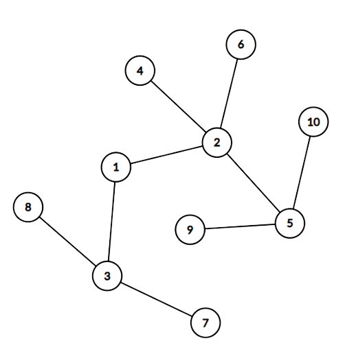

## 문제

서울과학고의 기숙사는 $N$개의 방과 서로 다른 두 방을 연결하는 $N-1$개의 복도로 이루어진 트리 형태로 표현할 수 있다. 방들은 각각 $1$부터 $N$까지의 수 중 하나를 번호로 가지고 있다. 모든 복도는 양방향으로 이동할 수 있고, 복도를 이용해 모든 방 사이를 이동할 수 있다.

서울과학고에는 총 $N$명의 학생이 있으며, 각각 $1$부터 $N$까지의 수 중 하나를 번호로 가지고 있다. $i$번 학생은 기숙사의 $i$번 방에서 밤을 지낸다.

서울과학고에는 닌자부가 있다는 오랜 전설이 있다. 닌자부의 부원이 누구인지는 알려지지 않았으나, **적어도 한 명의 부원이 있다**고 알려져 있다. 전설에 따르면, 이들은 밤마다 기숙사의 방 중 한 방에서 파티를 연다고 한다. 닌자부의 부원들은 다음과 같은 규칙으로 파티를 열 방을 정한다.

* $u$번 방과 $v$번 방의 거리는 두 방 사이를 이동할 때 거쳐야 하는 최소 복도의 수로 정의한다.
* 어떤 방 $p$에 대해, 만약 다른 방 $r\neq p$가 존재해, $r$번 방이 모든 닌자부 부원들의 방에서 $p$번 방보다 거리가 가깝다면, $p$번 방에서는 파티를 열지 않는다.
* 위 조건을 위배하지 않는 모든 방 중 가장 번호가 **큰** 방에서 파티를 연다. 이 방이 닌자부 부원의 방이 아닐 수도 있다는 데에 주의하여라.

예를 들어, 서울과학고의 기숙사가 아래 그림과 같다고 하자. 닌자부에 소속된 학생들의 번호의 집합 $S=\{4,5,8\}$이라면, 파티가 열릴 조건을 위배하지 않는 방은 $1$, $2$, $3$, $4$, $5$, $8$번 방이고, 이 중 번호가 가장 큰 $8$번 방에서 파티가 열리게 된다.

서울과학고의 학생들은 최근에 수학여행을 다녀왔다. 수학여행에서 묵은 숙소 역시 $N$개의 방과 서로 다른 두 방을 연결하는 $N-1$개의 복도로 이루어진 트리 형태로 표현할 수 있다.

열정이 많은 닌자부 부원들은 수학여행을 가서도 파티를 열었다. 이때 파티가 열리는 장소를 선택하는 방법은 이전과 같았다.

서울과학고 기숙사 사감인 지후는 서울과학고 기숙사와 수학여행 숙소에서 파티가 열린 방의 번호가 같다는 사실을 알게 되었다. 지후는 이 정보를 토대로 닌자부 부원들이 누구인지 알아내려고 한다. 닌자부 부원들의 번호의 집합으로 가능한 것의 개수를 구하여라.

## 입력

첫째 줄에 학생의 수 $N$이 주어진다.

둘째 줄부터 $N$번째 줄까지 $i+1$번째 줄에는 두 정수 $A\_i$와 $B\_i$가 공백으로 구분되어 주어진다. 이는 서울과학고 기숙사의 $i$번째 복도가 방 $A\_i$와 방 $B\_i$를 연결한다는 뜻이다.

$N+1$번째 줄부터 $2N-1$번째 줄까지 $i+N$번째 줄에는 두 정수 $C\_i$와 $D\_i$가 공백으로 구분되어 주어진다. 이는 수학여행 숙소의 $i$번째 복도가 방 $C\_i$와 방 $D\_i$를 연결한다는 뜻이다.

## 출력

닌자부에 소속된 부원들의 번호의 집합으로 가능한 것의 개수를 $10^9+7$로 나눈 나머지를 출력한다.
