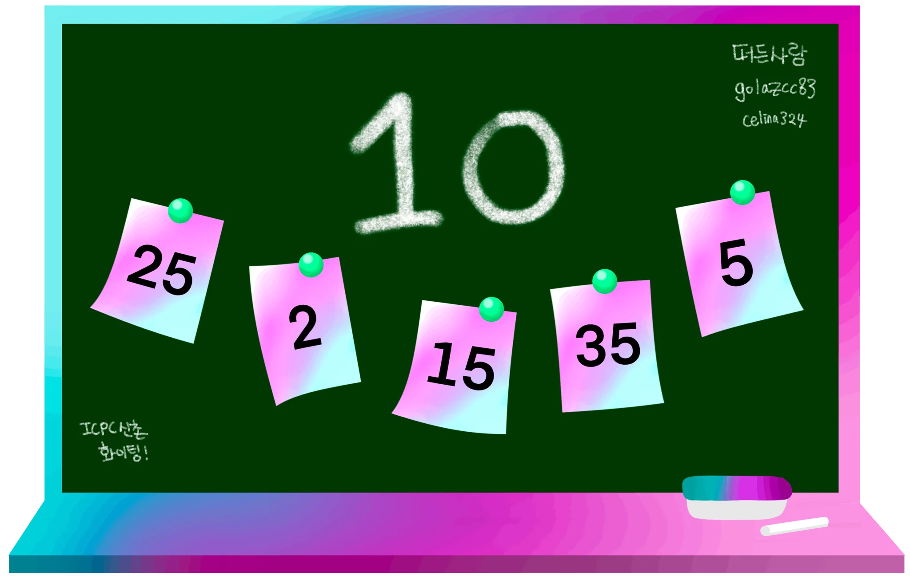

## 문제

철수와 영희는 $N$개의 카드로 구성된 카드 뭉치와 칠판을 가지고 최대공약수 카드 게임을 진행한다.

각 카드는 $1$번부터 $N$번까지 번호가 매겨져 있고 $i$번 카드에는 양의 정수 $A\_i$가 적혀 있으며 칠판에는 $2$ 이상의 정수 $X$가 적혀 있다. 게임은 철수부터 시작해서 아래의 과정을 수행하며 턴을 진행한다.

1. 카드 뭉치에서 카드를 하나 고른다. 이때 칠판에 적힌 수와 플레이어가 고른 카드에 적힌 수의 최대공약수가 $1$이면 안 된다.
2. 칠판에 적힌 수와 카드에 적힌 수의 최대공약수를 칠판에 새로 적고, 원래 칠판에 적힌 수는 지운다.
3. 플레이어가 고른 카드는 카드 뭉치에서 제외한다.

자신의 턴에 카드 뭉치에서 고를 수 있는 카드가 없을 때 (더 이상 카드가 없거나 어떤 카드를 고르더라도 칠판에 적힌 수가 $1$이 되는 경우) 해당 플레이어는 패배하게 된다. 철수와 영희는 이 게임에서 최선의 전략을 알고 있고 이를 활용하여 게임에 참여한다. 게임을 시작하기 전 칠판에 적힌 수와 카드의 조합이 주어졌을 때 승자를 판단해 보자.

## 입력

첫 번째 줄에 카드의 수 $N$, 칠판에 적은 양의 정수 $X$가 공백으로 구분되어 주어진다. $(1 \leq N \leq 300;$ $2 \leq X \leq 10^9)$

두 번째 줄에 카드에 적힌 양의 정수 $A\_1, A\_2, \dots, A\_N$가 공백으로 구분되어 주어진다. $(1 \leq A\_i \leq 10^9)$

## 출력

철수가 이긴다면 `First`, 영희가 이긴다면 `Second`를 출력한다.
