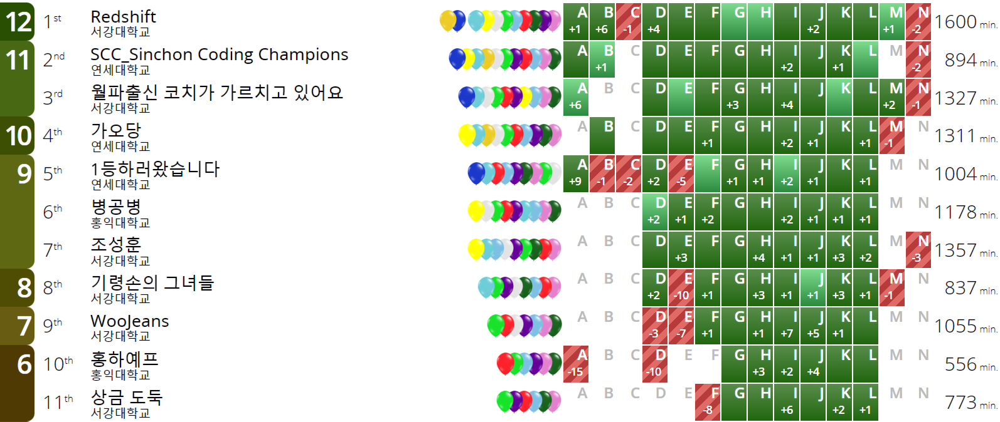

## 문제

[그림] SUAPC 2023 Summer 스코어보드 ([링크](./002_1104))

SUAPC는 신촌지역 5개 대학(서강, 숙명, 연세, 이화, 홍익)의 학부생 및 대학원 1년 차를 대상으로 하는 프로그래밍 대회다. 대회 문제는 서울 리저널의 문제 출제 경향을 따르며 제한 시간 동안 얼마나 많은 문제를 정확하게 풀 수 있는지를 평가하여 순위를 결정한다. 위의 사진은 SUAPC 2023 Summer의 스코어보드다.

문제를 많이 푼 팀이 고순위로 결정되며, 동일 수의 문제를 푼 팀이 다수 있는 경우 푼 문제들의 페널티(= (첫 정답을 제출한 시간) + (첫 정답을 받기 전까지 오답을 제출한 횟수) × 20)의 합이 작은 순으로 순위가 결정된다. 위 사진의 스코어보드상에서 가장 오른쪽에 적힌 수가 각 팀이 푼 문제들의 페널티의 합을 의미한다.

양의 정수 $N$이 주어졌을 때, SUAPC 2023 Summer에서 $N$등을 한 팀이 푼 문제 수와 푼 문제들의 페널티의 합을 구하여라.

## 입력

첫 번째 줄에 양의 정수 $N$이 주어진다. ($1 \le N \le 11$)

## 출력

SUAPC 2023 Summer에서 $N$등을 한 팀이 푼 문제 수와 푼 문제들의 페널티의 합을 공백으로 구분하여 출력한다.
