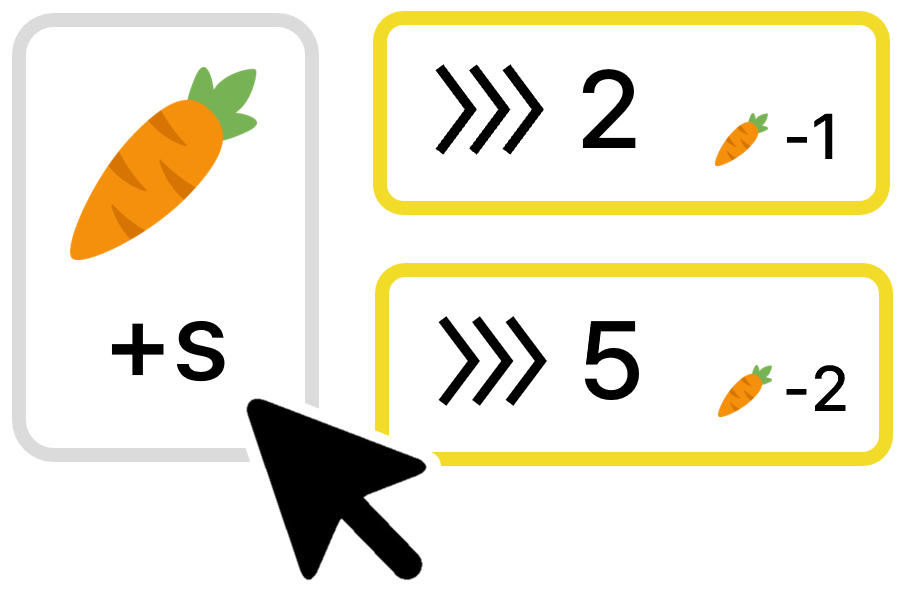

## 문제

에릭은 방학 동안 너무 심심한 나머지, **당근 클릭 게임**이라는 게임을 직접 만들어서 플레이하기로 했다.

이 게임에서 초기에 에릭은 당근을 $0$개 가지고 있고, $s$가 $1$인 상태로 게임을 시작한다.

그 후, 매초 다음 두 가지의 행동 중 하나를 할 수 있다.

1. 마우스를 클릭하고 당근을 $s$개 얻는다.
2. 정수 $i$$(1 \le i \le N)$를 고르고, 당근 $A\_i$개를 지불하여 $i$번째 스피드 효과를 구매한다. 구매 직후, $s$가 $B\_i$만큼 증가한다. (이전에 구매한 스피드 효과를 다시 구매하는 것도 가능하다.)

게임을 개발하느라 에너지를 모두 소모해 버린 에릭을 위해 게임을 $K$초 플레이한 후 당근을 최대 몇 개까지 가지고 있을 수 있는지 알려주자!

## 입력

첫 번째 줄에 두 정수 $N$, $K$가 공백으로 구분되어 주어진다.

다음 $N$개의 줄 중 $i$번째 줄에 두 정수 $A\_i$, $B\_i$가 공백으로 구분되어 주어진다.

## 출력

에릭이 게임을 $K$초 플레이한 후 최대로 가지고 있을 수 있는 당근의 개수를 출력한다.
