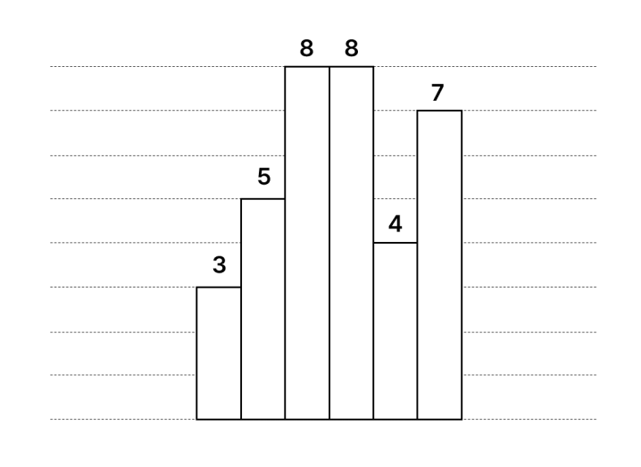

## 문제

> Study nature: 자연을 탐구하고 세상의 문제를 발견하는 인재.

위 문장은 KSA 비전 2040에서 공개된 모토의 일부다.

하지만 본 문제의 출제자는 KSA를 졸업했으므로, 남의 문제를 베껴오기로 하였다. 본 문제는 [히스토그램에서 가장 큰 직사각형과 쿼리 (16977)](./001_16977)를 베껴와 몇 글자만 바꾼 문제다.

히스토그램은 직사각형 여러 개가 아래쪽으로 정렬되어 있는 도형이다. 각 직사각형은 너비가 $1$로 일정하지만, 높이는 서로 다를 수도 있다. 예를 들어, 다음 그림은 높이가 $3, 5, 8, 8, 4, 7$인 직사각형으로 이루어진 히스토그램이다.

히스토그램에서 아래와 같은 쿼리 $Q$개를 수행해보자.

* $l \, r$: $l$번째 직사각형부터 $r$번째 직사각형까지만 있을 때, 가장 넓이가 큰 직사각형의 넓이를 출력한다.

## 입력

첫 번째 줄에 직사각형의 수 $N$이 주어진다.

두 번째 줄에는 히스토그램에서 각 직사각형의 높이를 나타내는 $N$개의 정수 $H\_1, H\_2, \cdots, H\_N$가 공백으로 구분되어 왼쪽에서 오른쪽으로 순서대로 주어진다.

세 번째 줄에는 쿼리의 수 $Q$가 주어진다.

다음 $Q$개의 줄에 쿼리들의 정보가 주어지며, 각 줄에는 두 개의 정수 $l$, $r$이 공백으로 구분되어 주어진다.

## 출력

$Q$개의 줄에 걸쳐 각 쿼리의 정답을 출력한다.
