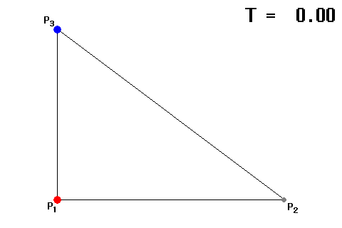

## 문제

처음 가는 길을 운전할 때 내비게이션이 있어도 갈림길을 잘못 들거나 차선을 잘못 타서 곤란했던 경험이 누구나 한 번쯤은 있을 것이다. SoleMap은 이런 불편을 해소하기 위해 현대오토에버가 개발 중인 차세대 통합 지도이다. '단 하나의 지도'라는 이름에 걸맞게 SoleMap은 일반적인 내비게이션 지도인 SD 맵, 위치 정확도가 높고 주행 보조 기능 구현에 필요한 정보가 구성되어 있는 ADAS 맵, 자율주행을 위한 정밀 지도인 HD 맵을 개선한 SD+ 맵을 통합해 운전자에게 더 정밀하고 직관적인 정보를 제공한다.

올해 출시를 목표하고 있는 SoleMap은 출시 전 삼각형 모양의 랜드마크 주변을 두르는 도로에서 테스트를 해 보고자 한다.

* 삼각형은 좌표평면 위의 세 꼭짓점 $P\_{1}$, $P\_{2}$, $P\_{3}$로 나타낼 수 있다.
* 거리는 유클리드 거리를 따른다. 즉, $(x\_{1}, y\_{1})$과 $(x\_{2}, y\_{2})$ 사이의 거리는 $\sqrt{(x\_{1} - x\_{2})^{2} + (y\_{1} - y\_{2})^{2}}$이다.
* 각각의 도로를 통해 $P\_{1}$에서 $P\_{2}$로, $P\_{2}$에서 $P\_{3}$로, $P\_{3}$에서 $P\_{1}$으로 이동할 수 있으며, **반대 방향으로는 이동할 수 없다**.
* 랜드마크 주변의 도로는 $P\_{i}$에서 $P\_{i+1}$을 잇는 도로가 $w\_{i}$-차선으로 **모두 다르기** 때문에, 차선에 따라 다른 정보를 제공해야 하는 SoleMap을 시험하는 데에 있어 최적의 장소이다. (단, $P\_{4} = P\_{1}$로 생각한다.)

두 대의 차량이 서로 다른 꼭짓점에서 동시에 출발해서 **같은 방향으로** 한 바퀴를 돌고자 한다. 두 차량은 차종이 달라 최대 속력이 다를 수 있는데, 테스트를 위해 언제나 가능한 최대 속력으로 달리기로 하였다. 또한, 한 도로를 점유하는 차량의 대수가 차선의 개수보다 많다면 한 차량이 다른 차량을 추월할 수 없다. (꼭짓점에는 넓은 공간이 있기 때문에 자유롭게 추월할 수 있다.)

여러분의 SoleMap의 도착 예정 시간이 정확한지 확인해야 한다. 두 대의 차량이 한 바퀴를 돌아 원래 꼭짓점으로 돌아오는 데에 걸리는 시간을 각각 출력하는 프로그램을 작성하시오.

## 입력

첫 번째 줄부터 $3$개의 줄에 걸쳐 $P\_{i}$의 정보가 주어진다. $i$번째 줄에는 $P\_{i}$의 $x$ 좌표 $x\_{i}$, $P\_{i}$의 $y$ 좌표 $y\_{i}$, 처음에 $P\_{i}$에 있는 차량의 최대 속력 $v\_{i}$가 공백을 사이에 두고 주어진다. ($-500 \leq x\_{i}, y\_{i} \leq 500$; $0 \leq v\_{i} \leq 500$) $v\_{i}$는 차량이 없는 경우 $0$이며, 차량이 있는 경우 양수로 주어진다. $v\_{i}$가 양수인 경우, 이 위치의 차량은 단위 시간 당 최대 $v\_{i}$의 거리를 이동할 수 있다.

네 번째 줄에 $w\_{1}$, $w\_{2}$, $w\_{3}$가 공백을 사이에 두고 주어진다. ($1 \leq w\_{i} \leq 8$)

입력으로 주어지는 모든 수는 정수이며, 주어지는 어떤 두 점도 같은 위치에 있지 않다. 또한 주어지는 $w\_{i}$는 모두 다르고, 주어지는 $v\_{i}$ 중 정확히 하나만이 $0$이다.

## 출력

$3$개의 줄을 출력한다. $i$번째 줄에는 처음에 $P\_{i}$에 위치해 있었던 자동차가 한 바퀴를 도는 데 걸리는 시간을 출력한다. 만일 해당 위치에 자동차가 없었다면 대신 `-`를 출력한다.

출력한 답이 정답과 $10^{-6}$ 이하의 절대/상대 오차를 갖는 경우 정답으로 인정한다.

## 힌트

예제의 $P\_{1}$ 지점에 있는 차량을 빨간색, $P\_{3}$ 지점에 있는 차량을 파란색으로 표시하였다.

* $3$초 시점에서, 최대 속력이 빠른 파란색 차가 최대 속력이 느린 빨간색 차를 추월하지 못해 빨간색 차와 같은 속도로 도로를 이동하게 된다.
* $4$초 시점에서 두 차가 모두 꼭짓점 $P\_{2}$에 도달하게 되며, 파란색 차가 빨간색 차를 추월해 도로를 다시 최대 속력으로 달리게 된다. 추월하는 데에 걸린 시간이 $0$초임에 유의하라.
* $6.5$초 시점에서 파란색 차는 한 바퀴를 다 돌았고 $P\_{3}$에 정지해 있게 된다.
* $9$초 시점에서 빨간색 차가 파란색 차를 꼭짓점에서 추월한다. $4$초 시점에서와 마찬가지로, 추월하는 데에 걸린 시간이 $0$초이다.
* $12$초 시점에서 빨간색 차는 한 바퀴를 돌았다.

빨간색 차는 $12$초, 파란색 차는 $6.5$초에 한 바퀴를 돌았으므로 예제 출력과 같이 출력한다.
