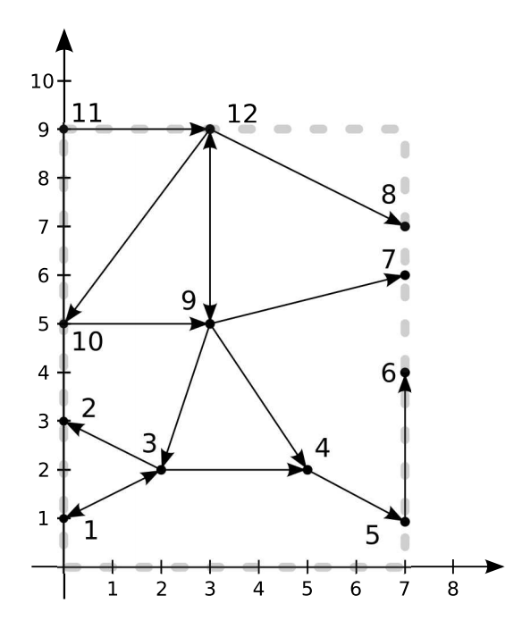

## 문제

The center of Gdynia is located on an island in the middle of the Kacza river. Every morning thousands of cars drive through this island from the residential districts on the western bank of the river (using bridge connections to junctions on the western side of the island) to the industrial areas on the eastern bank (using bridge connections from junctions on the eastern side of the island).

The island resembles a rectangle, whose sides are parallel to the cardinal directions. Hence, we view it as an A × B rectangle in a Cartesian coordinate system, whose opposite corners are in points (0, 0) and (A, B).

On the island, there are n junctions numbered from 1 to n. The junction number i has coordinates (xi, yi). If a junction has coordinates of the form (0, y), it lies on the western side of the island. Similarly, junctions with the coordinates (A, y) lie on the eastern side. Junctions are connected by streets. Each street is a line segment connecting two junctions. Streets can be either unidirectional or bidirectional. No two streets may have a common point (except for, possibly, a common end in a junction). There are are no bridges or tunnels. You should not assume anything else about the shape of the road network. In particular, there can be streets going along the river bank or junctions with no incoming or outgoing streets.

Because of the growing traffic density, the city mayor has hired you to check whether the current road network on the island is sufficient. He asked you to write a program which determines how many junctions on the eastern side of the island are reachable from each junction on the western side.

## 입력

The first line of the standard input contains four integers n, m, A and B (1 ≤ n ≤ 300 000, 0 ≤ m ≤ 900 000, 1 ≤ A, B ≤ 109). They denote the number of junctions in the center of Gdynia, the number of streets and dimensions of the island, respectively.

In each of the following n lines there are two integers xi, yi (0 ≤ xi ≤ A, 0 ≤ yi ≤ B) describing the coordinates of the junction number i. No two junctions can have the same coordinates.

The next m lines describe the streets. Each street is represented in a single line by three integers ci, di, ki (1 ≤ ci, di ≤ n, ci ≠ di, ki ∈ {1, 2}). Their meaning is that junctions ci and di are connected with a street. If ki = 1, then this is a unidirectional street from ci to di. Otherwise, the street can be driven in both directions. Each unordered pair {ci, di} can appear in the input at most once.

You can assume that there is at least one junction on the western side of the island from which it is possible to reach some junction on the eastern side of the island.

## 출력

Your program should write to the standard output one line for each junction on the western side of the island. This line should contain the number of junctions on the eastern side that are reachable from that junction. The output should be ordered according to decreasing y-coordinates of the junctions.

## 힌트

