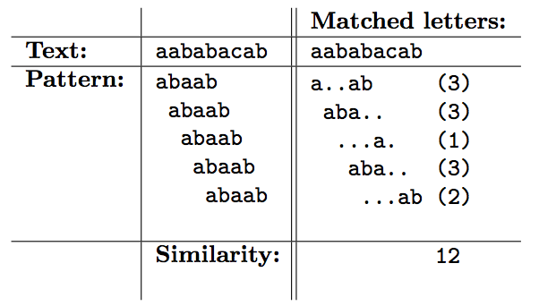

## 문제

Byteman works in a computational biology research team in Gdynia. He is a computer scientist, though, and his work is mainly concentrated on designing algorithms related to strings, patterns, texts etc. His current assignment is to prepare a tool for computing the similarity of a pattern and a text.

Given a pattern and a text, one can align them in many different ways, so that each letter of the pattern has a corresponding letter in the text. Here we only consider alignments without holes, in which the pattern is matched against a consecutive part of the text of length equal to the length of the pattern. For any such alignment, one can count the positions where the letter of the pattern is the same as the corresponding letter of the text. The sum of such numbers is called the similarity of the pattern and the text. The table below illustrates the computation of the similarity between an example pattern `abaab` and the text `aababacab`.

Byteman has already managed to implement the graphical interface of the tool. Could you help him in writing the piece of software responsible for computing the similarity?

## 입력

The standard input consists of two lines. The first line contains a non-empty string composed of small English letters — the pattern. The second line contains a non-empty string composed of small English letters — the text. You may assume that the length of the pattern does not exceed the length of the text. The text contains no more than 2 000 000 letters.

Additionally, in test cases worth 30 points the length of the text does not exceed 5 000.

## 출력

The only line of the standard output should contain the similarity of the given pattern and the text.

## 힌트

The example above is the same as in the task description.
